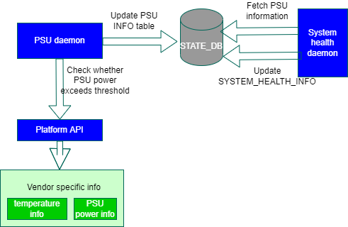
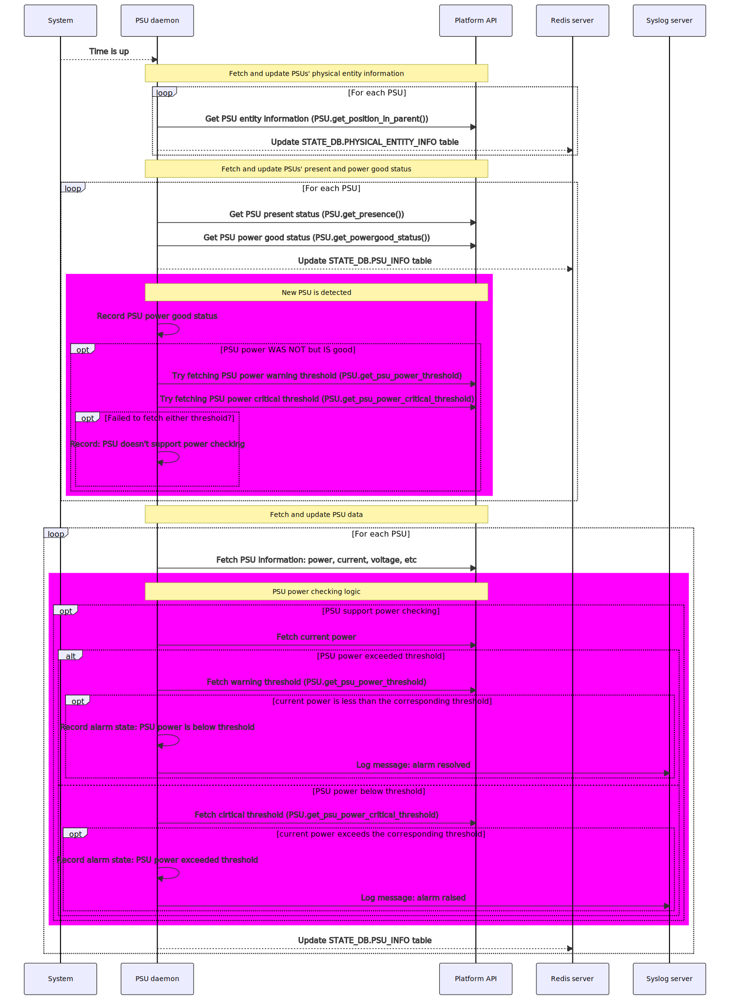

# PSU power check #

## Table of Content

### Revision

### Scope

This is the high level design of PSU power check in SONiC.

### Definitions/Abbreviations

N/A.

### Overview

An ethernet switch is typically equipped with more than one PSUs for redundancy. It can be deployed in different scenarios with different kinds of xSFP modules, traffic type and traffic load. All these factors affect the power consumption of an ethernet switch.

On some platforms, the capacity of a single PSU is not large enough to afford all the components and xSFP modules running at the highest performance at the same time. In this case, we do not have redundancy any longer. Users should be notified of that in order to take steps in advance.

In this document, we will introduce a way to check the current power of PSUs against their thresholds.

On some platforms, the maximum allowed power of the PSUs is not fxied but a dynamic value depending on other factors. For example, it can depend on the temperature of certain sensors on a switch to avoid overheat.

### Requirements

This section list out all the requirements for the HLD coverage and exemptions (not supported) if any for this design.

| # |Requirement|
|:-:|:---------:|
| 1 |PSU power check shall be performed when on the HW platform indicating the need for that via providing the dynamic power thresholds|
| 2 |PSU power check shall compare the current PSU power of one or both PSUs with the PSU max power capacity which depends on ambient temperature  which is the minimum of port and fan ambient temperature|
| 3 |PSU power check shall support 2 levels of temperature - warning and critical. The corresponding level for calculation shall be chosen based on system warning level|
| 4 |PSU power check shall be performed periodically no more than 20 seconds (no need to have it configurable)|
| 5 |PSU power check shall support hysterisis having different levels of power for entering (critical level) and exiting (warning) power limit|
| 6 |Customer/app shall be notified of crossing critical level (normal → warning → critical), warning level (critical → warning) and normal level|
| 7 |
| 8 |Notice log shall be generated on exiting the warning level|
| 9 |PSU overload state shall be stored in STATE DB|
|10 |Health monitor shall check the PSU overpower state in STATE DB and shall update SYSTEM_HEALTH_INFO|

### Architecture Design

No change to SONiC architecture.

- The periodic check will be executed in PSU daemon inside `pmon` docker.
- Two new platform APIs will be introduced to expose critical power threshold and power threshold.
- The information whether a power threshold is violated will be exposed to `STATE_DB`
- System health daemon will check PSU status based on the information in `STATE_DB`.

All the requirement can be adapted in the existing architecture.



__Figure 1: Architecture__

### Platform API

Two new platform APIs will be introduced for `PsuBase` to expose power threshold of a PSU. The thresholds can be volatile so the caller should call the API each time the thresholds are used.

The default behavior of both platform APIs is to raise a `NotImplementedError`. In this case, the PSU power check will not be executed.
In order to enable the PSU power check, both platform APIs should be implemented via returning a valid value.

1. get_psu_power_threshold

   This API returns the warning threshold of power of the PSU.
   ```
   def get_psu_power_threshold(self)
       """
       Retrieve the warning threshold of the power on this PSU
       The value can be volatile, so the caller should call the API each time it is used.

       Returns:
           A float number, the warning threshold of the PSU in watts.
       """
       raise NotImplementedError
   ```

2. get_psu_power_critical_threshold

   This API returns the critical threshold of power of the PSU.
   ```
   def get_psu_power_critical_threshold(self)
       """
       Retrieve the critical threshold of the power on this PSU
       The value can be volatile, so the caller should call the API each time it is used.

       Returns:
           A float number, the critical threshold of the PSU in watts.
       """
       raise NotImplementedError
	```

### STATE_DB update

#### PSU_INFO table

A new field `power_overload` will be introduced into `PSU_INFO` table in `STATE_DB` to represent whether a PSU's power consumption exceeds the threshold.

    ```
    power_overload = "true" / "false"
    power_threshold = 1*2.4DIGIT        ; The power threshold which is exceeded in case power_overload is true
	```

#### SYSTEM_HEALTH_INFO

A new value `PSU x's power <power> is reaching <critical|warning> threshold <threshold>` will be introduced into field `PSU X` in `SYSTEM_HEALTH_INFO` table in `STATE_DB` to indicate whether there is a PSU in power overload state in the system.

    ```
	`PSU x` = PSU x's power is reaching <critical|warning> threshold
	```

### PSU daemon

We will leverage the existing framework of PSU daemon, adding corresponding logic to perform PSU power check.
The following diagram is the flow of the PSU daemon where the flows in red represent the new flows introduced for PSU power checking.

Currently, PSU daemon is waken up periodically, executing the following flows (flows in bold are newly introduced by the feature):

1. Check the PSUs' physical entity information and update them into database
2. Check the PSUs' present and power good information and update them to database
   - __It will check the capability of PSU power check via reading PSU power thresholds when a new PSU is detected.__
3. Check and update the PSUs' data
   - Fetch voltage, current, power via calling platform API
   - __Perform PSU power checking logic__
   - Update all the information to database



We will detail the new flows in the following sections.

#### Control the period at which the PSU power is checked

On Nvidia platform, the PSU daemon should check PSU power no more than every 20 seconds.

In case a vendor wants the the PSU power to be checked at another period, the number of seconds can be customized in `<PLATFORM_DIR>/pmon_daemon_control.json` as below

```
{
    "psu_power_check_period": 20
}
```

#### New PSU is detected

Basically, there are two scenarios in which a new PSU can be detected:

- On PSU daemon starting, all PSUs installed on the switch are detected
- On new PSU pulgged, the new PSU is detected

When one or more new PSUs is detected, PSU daemon tries retrieving the warning and critical threshold for each PSU installed on the switch.

The PSU power checking will not be checked for a PSU if `NotImplemented` exception is thrown while either threshold is being retrieved

#### Alarm raising and clearing threshold

By default,

- an alarm will be raised when a PSU's power is rising accross the critical threshold
- an alarm will be cleared when a PSU's power is dropping across the warning threshold

We use asymmetric thresholds between raising and clearing the alarm for the purpose of creating a hysteresis and avoiding alarm flapping.

#### PSU power checking logic

For each PSU supporting power checking:

1. Retrieve the current power
2. If flag `PSU power exceeded threshold` is `true`, compare the current power against the warning threshold
   - If `current power` <= `warning threshold`
     - Set `PSU power exceeded threshold` to `false`
     - Message in NOTICE level should be logged: `PSU <x>: current power <power> is below the warning threshold <threshold>` where
       - `<x>` is the number of the PSU
       - `<power>` is the current power of the PSU
       - `<threshold>` is the warning threshold of the PSU according to the current ambient temperature
   - Otherwise: no action
3. Otherwise, compare the current power against the critical threshold
   - If `current power` >= `critical threshold`
     - Set `PSU power exceeded threshold` to `true`
     - Message in WARNING level should be logged: `PSU <x>: current power <power> is exceeding the critical threshold <threshold>` where
       - `<x>` is the number of the PSU
       - `<power>` is the current power of the PSU
       - `<threshold>` is the warning threshold of the PSU according to the current ambient temperature
   - Otherwise: no action

### System health daemon

Currently, there has been a logic to check PSUs' statuses in system health daemon. The following fields in `STATE_DB.PSU_INFO` table are checked. For both fields, `true` represents the health state.

- presence: whether the PSU is present or absent
- status: whether the PSU power is good or not

To support PSU power check, we need to check the field `power_overload` as well. `true` represents the health state.

In case the `power_overload` is `true` for a PSU, the `STATE_DB.SYSTEM_HEALTH_INFO` will be updated for the PSU as `PSU x's power <power> is reaching <critical|warning> threshold <threshold>`, where `<power>` and `threshold` are fetched from STATE_DB.PSU_INFO table.

### CLI Update

#### show platform psustatus

The PSU power exceeding status will be displayed via using column `Power exceeding` whose content can be the following:
- `N/A` which represents the PSU power checking is not supported on the platform
- `OK` which represents no alarm raised due to PSU power exceeding the threshold
- `Not OK (threshold:<threshold>)` which represents an alarm raised due to PSU power exceeding the threshold. In this case, the warning threshold is displayed.

An example output can be:

    admin@sonic:~$ show platform  psustatus
    PSU    Model          Serial        HW Rev      Voltage (V)    Current (A)    Power (W)  Power exceeding status   Status    LED
    -----  -------------  ------------  --------  -------------  -------------  -----------  ------------------------ --------  -----
    PSU 1  MTEF-PSF-AC-A  MT1629X14911  A3                12.08           5.19        62.62  Not OK (threshold:60.00) OK        green
    PSU 2  MTEF-PSF-AC-A  MT1629X14913  A3                12.01           4.38        52.50  OK                       OK        green

#### show system-health

##### show system-health detail

The PSU status will be `Not OK` if an alarm is raised due to its power exceeding the threshold.

An example output is:

    admin@sonic:~$ sudo show system-health detail
    System status summary

    System status LED  red
    Services:
        Status: OK
    Hardware:
        Status: Not OK
        Reasons: PSU 1 power exceeds threshold

    System services and devices monitor list

    Name                        Status    Type
    --------------------------  --------  ----------
    sonic                       OK        System
    rsyslog                     OK        Process
    root-overlay                OK        Filesystem
    var-log                     OK        Filesystem
    routeCheck                  OK        Program
    diskCheck                   OK        Program
    container_checker           OK        Program
    vnetRouteCheck              OK        Program
    memory_check                OK        Program
    container_memory_telemetry  OK        Program
    database:redis              OK        Process
    teamd:teammgrd              OK        Process
    teamd:teamsyncd             OK        Process
    teamd:tlm_teamd             OK        Process
    syncd:syncd                 OK        Process
    swss:orchagent              OK        Process
    swss:portsyncd              OK        Process
    swss:neighsyncd             OK        Process
    swss:fdbsyncd               OK        Process
    swss:vlanmgrd               OK        Process
    swss:intfmgrd               OK        Process
    swss:portmgrd               OK        Process
    swss:buffermgrd             OK        Process
    swss:vrfmgrd                OK        Process
    swss:nbrmgrd                OK        Process
    swss:vxlanmgrd              OK        Process
    swss:coppmgrd               OK        Process
    swss:tunnelmgrd             OK        Process
    bgp:zebra                   OK        Process
    bgp:staticd                 OK        Process
    bgp:bgpd                    OK        Process
    bgp:fpmsyncd                OK        Process
    bgp:bgpcfgd                 OK        Process
    lldp:lldpd                  OK        Process
    lldp:lldp-syncd             OK        Process
    lldp:lldpmgrd               OK        Process
    snmp:snmpd                  OK        Process
    snmp:snmp-subagent          OK        Process
    telemetry:telemetry         OK        Process
    telemetry:dialout           OK        Process
    PSU 1                       Not OK    PSU
    ASIC                        OK        ASIC
    fan1                        OK        Fan
    fan2                        OK        Fan
    fan3                        OK        Fan
    fan4                        OK        Fan
    fan5                        OK        Fan
    fan6                        OK        Fan
    fan7                        OK        Fan
    fan8                        OK        Fan
    psu1_fan1                   OK        Fan
    psu2_fan1                   OK        Fan
    PSU 2                       OK        PSU
### SAI API

N/A.

### Configuration and management
This section should have sub-sections for all types of configuration and management related design. Example sub-sections for "CLI" and "Config DB" are given below. Sub-sections related to data models (YANG, REST, gNMI, etc.,) should be added as required.

#### Manifest (if the feature is an Application Extension)

Paste a preliminary manifest in a JSON format.

#### CLI/YANG model Enhancements 

No additional yang module enhancement.

#### Config DB Enhancements

N/A

### Warmboot and Fastboot Design Impact

No additional logic is required for warmreboot and fast reboot.

### Restrictions/Limitations

### Testing Requirements/Design  
Explain what kind of unit testing, system testing, regression testing, warmboot/fastboot testing, etc.,
Ensure that the existing warmboot/fastboot requirements are met. For example, if the current warmboot feature expects maximum of 1 second or zero second data disruption, the same should be met even after the new feature/enhancement is implemented. Explain the same here.
Example sub-sections for unit test cases and system test cases are given below. 

#### Unit Test cases  

#### System Test cases

### Open/Action items - if any 

1. why 20 seconds? can we check it at the same frequency PSU daemon runs? any drawback if we check it every 3 second?
2. we should check PSU power for each power independently, we should not check the accumulative value against the accumulative threshold.
	
NOTE: All the sections and sub-sections given above are mandatory in the design document. Users can add additional sections/sub-sections if required.

### Appendix

#### Platform API implementation on NVIDIA platform

On NVIDIA platform,

- The PSU power checking mechanism is required only if `/var/run/hw-management/config/psuX_power_capacity` exists, where X is the number of PSU. In case the file does not exist, `NotImplemented` will be thrown when `get_psu_power_threshold` or `get_psu_power_critical_threshold` is called.
- The PSU power warning and critical thresholds depends on the temperature reported by certain ambient sensors.
  - get_psu_power_threshold

    ```
    temp_amb = min(fan_amb, port_amb)
    if temp_amb <= temp_warn
        max_power = PSU.max_power
    else
        max_power = PSU.max_power - slope * (temp_amb - temp_warn)
    ```

  - get_psu_power_critical_threshold

    ```
    temp_amb = min(fan_amb, port_amb)
    if temp_amb <= temp_crit
        max_power = PSU.max_power
    else
        max_power = PSU.max_power - slope * (temp_amb - temp_crit)
    ```

```
sequenceDiagram
    System -->> PSU daemon: Time is up
    Note over PSU daemon, Platform API: Fetch and update PSUs' physical entity information
    loop For each PSU
        PSU daemon ->> Platform API: Get PSU entity information (PSU.get_position_in_parent())
        PSU daemon -->> Redis server: Update STATE_DB.PHYSICAL_ENTITY_INFO table
    end
    Note over PSU daemon, Platform API: Fetch and update PSUs' present and power good status
    loop For each PSU
        PSU daemon ->> Platform API: Get PSU present status (PSU.get_presence())
        PSU daemon ->> Platform API: Get PSU power good status (PSU.get_powergood_status())
        PSU daemon -->> Redis server: Update STATE_DB.PSU_INFO table
        rect rgb(255, 0, 255)
            Note over PSU daemon, Platform API: New PSU is detected
            PSU daemon ->> PSU daemon: Record PSU power good status
            opt PSU power WAS NOT but IS good
                PSU daemon ->> Platform API: Try fetching PSU power warning threshold (PSU.get_psu_power_threshold)
                PSU daemon ->> Platform API: Try fetching PSU power critical threshold (PSU.get_psu_power_critical_threshold)
                opt Failed to fetch either threshold?
                    PSU daemon ->> PSU daemon: Record: PSU doesn't support power checking
                end
            end
        end
    end
    Note over PSU daemon, Platform API: Fetch and update PSU data
    loop For each PSU
        PSU daemon ->> Platform API: Fetch PSU information: power, current, voltage, etc
        rect rgb(255, 0, 255)
            Note over PSU daemon, Platform API: PSU power checking logic
            opt PSU support power checking
                PSU daemon ->> Platform API: Fetch current power
                    alt PSU power exceeded threshold
                        PSU daemon ->> Platform API: Fetch warning threshold (PSU.get_psu_power_threshold)
                        opt current power is less than the corresponding threshold
                            PSU daemon ->> PSU daemon: Record alarm state: PSU power is below threshold
                            PSU daemon ->> Syslog server: Log message: alarm resolved
                        end
                    else PSU power below threshold
                        PSU daemon ->> Platform API: Fetch cirtical threshold (PSU.get_psu_power_critical_threshold)
                        opt current power exceeds the corresponding threshold
                            PSU daemon ->> PSU daemon: Record alarm state: PSU power exceeded threshold
                            PSU daemon ->> Syslog server: Log message: alarm raised
                        end
                    end
            end
        end
        PSU daemon -->> Redis server: Update STATE_DB.PSU_INFO table
    end
```