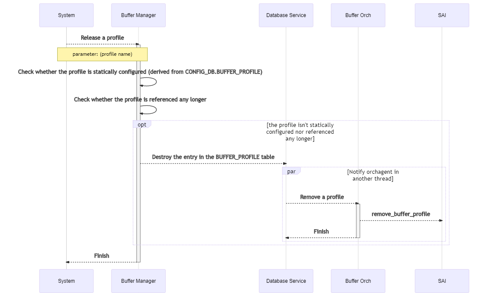
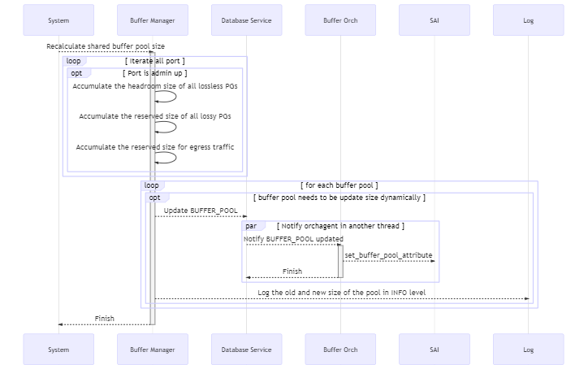
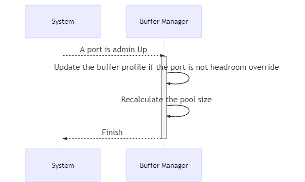

# Dynamically Headroom Calculation

## Abbreviations

| Term | Meaning |
|:--------:|:---------------------------------------------:|
| Statically headroom look-up | The current solution of headroom calculation. In this solution, the headroom is retrieved by looking up a pre-defined table with the port's cable length and speed as the key. Only a limited set of cable length is supported. Or `statically look-up` for short.|
| Dynamically headroom calculation | The solution of headroom calculation which will be introduced in this design. In this solution the headroom is calculated by the well known formula based with the cable length and speed as input. Arbitrary cable length will be supported. Or `dynamically calculation` for short.|

## Introduction

RoCE is an important feature in the datacenter network. As we all knew, headroom size is the key to ensure lossless traffic which is the key of RoCE.
Currently, the headroom size is calculated by looking up the port's cable length and speed in the pre-defined pg_profile_lookup.ini, which has some drawbacks.

### Current Solution

Currently the headroom buffer calculation is done by looking up the `pg_profile_lookup.ini` table with the ports' cable length and speed as the key.

- When system start, it reads the pg_profile_lookup.ini and generates an internal lookup table indexed by speed and cable length, and containing size, xon, xoff and threshold.
- When a port's cable length updated, it records the cable length of the port. But it doesn't update relavent tables accordingly.
- When a port's speed updated,
    1. It looks up the (speed, cable length) tuple in the BUFFER_PROFILE table or generate a new profile according to the internal lookup table.
    2. And then update the port's BUFFER_PG table for the lossless priority group.

There are some limitations:

- The `pg_profile_lookup.ini` is predefined for each SKU. When a new system supports SONiC the file should be provided accordingly.
- Only a fixed set of cable lengths are supproted.
- Static headroom isn't supported.

In general, we would like to:

1. have the headroom calculated in the code so that the users won't need to be familiar with that.
2. support headroom override, which means we will have fixed headroom size on some ports regardless of the ports' speed and cable length.
3. have more shared buffer and less headroom.

The headroom size calculation discussed in this design will be implemented in the `BufferManager` which is a daemon running in the swss docker.

### The Requirement

We will have the following groups of parameters

- List of SONiC configuration, such as speed and cable length.
- List of ASIC related configuration, such as cell size, MAC/PHY delay, peer response time, IPG.
- List of PERIPHERIAL related configuration, such as gearbox delay.
- List of RoCE related configuration, such as MTU, small packet size percentage.

Based on the parameters and a well-known formula the code in buffer manager will do the calculation and not take it from a pre-defined values as we have today.
On top of that, we need to support the ability to override headroom and not to calculate it in the code.

Meanwhile, the backward compatibility for the vendors who haven't provided the tables required for dynamically headroom calculation is also provided.

### The behavior of the dynamically headroom calculation solution

- When a port's cable length or speed updated, headroom of all lossless priority groups will be updated according to the well-known formula and then programed to ASIC.
- When a port is shut down/started up or its headroom size is updated, the size of shared buffer pool will be adjusted accordingly. The less the headroom, the more the shared buffer and vice versa. By doing so, we are able to have as much shared buffer as possible.
- When SONiC switch is upgraded from statically look-up to dynamically calculation, a port's headroom size of all the lossless priority groups will remain untouched until its cable length or speed updated. The shared buffer pool will always be adjusted according to the headroom size.
- Pre-defined table isn't required any more. When a new platform supports SONiC only a few parameters are required.
- Support arbitrary cable length.
- Support headroom override, which means user can configure static headroom on certain ports.
- Only priority groups 3-4 are treated as lossless priority and their headrooms will be updated dynamically as mentioned above. If lossless traffic need to run on other priorities, headroom override can be used to achieve that.
- Ports' speed and cable length need to be statically configured.

### Backward compatibility

Backward compatibility is supported for vendors who haven't provided the related tables yet. In this section we will introduce the way it is achieved.

Currently, the SONiC system starts buffer manager from swss docker by the `supervisor` according to the following settings in [`/etc/supervisor/conf.d/supervisord.conf`](https://github.com/Azure/sonic-buildimage/blob/master/dockers/docker-orchagent/supervisord.conf) in `swss` docker.

```shell
[program:buffermgrd]
command=/usr/bin/buffermgrd -l /usr/share/sonic/hwsku/pg_profile_lookup.ini
priority=11
autostart=false
autorestart=false
stdout_logfile=syslog
stderr_logfile=syslog
```

For the vendors who implement dynamically buffer calculating, a new command line option `-c` is provided. As a result, the `supervisor` setting will be:

```shell
[program:buffermgrd]
command=/usr/bin/buffermgrd -c
priority=11
autostart=false
autorestart=false
stdout_logfile=syslog
stderr_logfile=syslog
```

A new class is introduced to implement the dynamically buffer calculating while the class for statically look-up solution is remained.
When buffer manager starts it will test the command line options, loading the corresponding class according to the command line option.

The database schema for the dynamically buffer calculation is added on top of that of the current solution without any field renamed or removed, which means it won't hurt the current solution.

In the rest part of this document, we will focus on the dynamically headroom calculation and the SONiC-to-SONiC upgrade process from the current solution to the new one.

## Database schema design

### CONFIG_DB

#### Table ASIC_TABLE

This table is introduced to store the switch ASIC related parameters required for calculating the headroom buffer size.

This table is not supposed to be updated on-the-fly.

##### Schema

The key can be the chip/vendor name in captical letters.

```schema
    key                     = ASIC_TABLE|<vendor name>      ; Vendor name should be in captical letters.
                                                            ; For Mellanox, "MELLANOX"
    cell_size               = 1*4DIGIT                      ; Mandatory. The cell size of the switch chip.
    ipg                     = 1*2DIGIT                      ; Optional. Inter-packet gap.
    pipeline_latency        = 1*6DIGIT                      ; Mandatory. Pipeline latency, in unit of kBytes.
    mac_phy_delay           = 1*6DIGIT                      ; Mandatory. Max/phy delay, in unit of Bytes.
    peer_response_time      = 1*6DIGIT                      ; Mandatory. The maximum of peer switch response time
                                                            ; in unit of kBytes.
```

##### Initialization

Every vendor should provide the ASIC_TABLE for all switch chips it supports in SONiC. It should be stored in `files/build_templates` in the [sonic-buildimage](https://github.com/azure/sonic-buildimage) repo and `/usr/shared/sonic/template/asic_config.json.j2` on the switch.

There should be a map from SKU to switch chip in the template. When the template is being rendering, the SKU will be mapped to switch chip and the switch chip is used to choose which group of parameters in the `ASIC_TABLE` will be adopted on the switch. As a result, the `ASIC_TABLE` with a single group of parameters will be loaded into config database.

The rendering takes place on the switch when the command `config qos reload` is executed when the switch starts for the first time or `config load_minigraph` is executed.

After that the table will be loaded from config database each time system starts.

***Example***

The below is an example for Mellanox switches based on Spectrum-1 switch chip.

Example of pre-defined json.j2 file:

```json

    {% set platform2asic = {
            'x86_64-mlnx_lssn2700-r0':'MELLANOX-SPECTRUM'
            'x86_64-mlnx_msn2010-r0':'MELLANOX-SPECTRUM'
            'x86_64-mlnx_msn2100-r0':'MELLANOX-SPECTRUM'
            'x86_64-mlnx_msn2410-r0':'MELLANOX-SPECTRUM'
            'x86_64-mlnx_msn2700-r0':'MELLANOX-SPECTRUM'
            'x86_64-mlnx_msn2700_simx-r0':'MELLANOX-SPECTRUM'
            'x86_64-mlnx_msn2740-r0':'MELLANOX-SPECTRUM'
            'x86_64-mlnx_msn3700c-r0':'MELLANOX-SPECTRUM-2'
            'x86_64-mlnx_msn3700-r0':'MELLANOX-SPECTRUM-2'
            'x86_64-mlnx_msn3700_simx-r0':'MELLANOX-SPECTRUM-2'
            'x86_64-mlnx_msn3800-r0':'MELLANOX-SPECTRUM-2'
            'x86_64-mlnx_msn4700_simx-r0':'MELLANOX-SPECTRUM-3'
            'x86_64-mlnx_msn4700-r0':'MELLANOX-SPECTRUM-3'
        }
    %}
    
    "ASIC_TABLE": {
        
        "MELLANOX-SPECTRUM": {
            "cell_size": "96",
            "pipeline_latency": "18",
            "mac_phy_delay": "0.8",
            "peer_response_time": "3.8"
        }
        

        
        "MELLANOX-SPECTRUM-2": {
            "cell_size": "144",
            "pipeline_latency": "18",
            "mac_phy_delay": "0.8",
            "peer_response_time": "3.8"
        }
        

        
        "MELLANOX-SPECTRUM-3": {
            "cell_size": "144",
            "pipeline_latency": "18",
            "mac_phy_delay": "0.8",
            "peer_response_time": "3.8"
        }
        
    }

```

Example of a rendered json snippet (which will be loaded into config database) on a Mellanox Spectrum switch:

```json
    "ASIC_TABLE": {
        "MELLANOX-SPECTRUM": {
            "cell_size": "96",
            "pipeline_latency": "18",
            "mac_phy_delay": "0.8",
            "peer_response_time": "3.8"
        }
    }
```

#### Table PERIPHERAL_TABLE

##### Schema

This table contains the peripheral parameters, like gearbox. The key can be gearbox model name.

This table is not supposed to be updated on-the-fly.

```schema
    key                     = PERIPHERAL_TABLE|<gearbox model name>   ; Model name should be in captical letters.
    gearbox_delay           = 1*4DIGIT      ; Optional. Latency introduced by gearbox, in unit of kBytes.
```

##### Initialization

Every vendor should provide the `PERIPHERAL_TABLE` for all peripheral devices it supports in SONiC, like gearbox models. It should be stored in `files/build_templates/peripheral_config.json.j2` in the [sonic-buildimage](https://github.com/azure/sonic-buildimage) repo and `/usr/shared/sonic/template/peripheral_config.json.j2` on the switch.

When the template is being rendering, all entries in `PERIPHERAL_TABLE` will be loaded into the configuration database.

There should be a gearbox configure file in which the gearbox model installed in the system is defined.

For non-chassis systems, all ports share the unique gearbox model. As a result, the initialization of `PERIPHERAL_TABLE` is the same as that of `ASIC_TABLE`.

For chassis systems the gearbox in variant line-cards can differ, which means a mapping from port/line-card to gearbox model is required to get the correct gearbox model for a port. This requires additional field defined in `PORT` table or some newly introduced table. As this part is still under discussion in community, we will not discuss this case for now.

The below is an example for Mellanox switches.

***Example***

```json

    
    
    
    
    "PERIPHERAL_TABLE": {
        "MELLANOX-PERIPHERAL-1": {
            "gearbox_delay": "9.765"
        }
    }
    

```

#### Table ROCE_TABLE

This table contains the parameters related to RoCE configuration.

##### schema

```schema
    key                     = ROCE_TABLE|<name>   ; Name should be in captical letters. For example, "AZURE"
    mtu                     = 1*4DIGIT      ; Mandatory. Max transmit unit of RDMA packet, in unit of kBytes.
    small_packet_percentage = 1*3DIGIT      ; Mandatory. The percentage of small packets against all packets.
```

##### Initialization

Typically all vendors share the identical RoCE parameters. It should be stored in `/usr/share/sonic/templates/buffers_config.j2` which will be used to render the buffer configuration by `config qos reload`.

***Example***

```json
    "ROCE_TABLE": {
        "AZURE": {
            "mtu": "1500",
            "small_packet_percentage": "100"
        }
    }
```

#### BUFFER_PROFILE

Table BUFFER_PROFILE contains the profiles of headroom parameters and the proportion of free shared buffers can be utilized by a `port`, `PG` tuple on ingress side or a `port`, `queue` tuple on egress side.

##### Schema

Currently, there are the following fields in `BUFFER_PROFILE` table.

```schema
    key             = BUFFER_PROFILE|<name>
    pool            = reference to BUFFER_POOL object
    size            = 6*DIGIT               ; size of headroom for ingress lossless
    dynamic_th      = 2*DIGIT               ; for dynamic pools, proportion of free pool the port, PG tuple referencing this profile can occupy
    static_th       = 10*DIGIT              ; similar to dynamic_th but in unit of bytes
```

The schema is the same as it is except the following field added.

```schema
    type        = "static" / "dynamic"      ; Optional. Whether the profile is dynamically calculated or user configured.
                                            ; Default value is "static"
```

The `static` profile is configured by CLI while the `dynamic` profile is dynamically calculated when system starts or a port's cable length or speed is updated.

##### Initialization

The following entries are mandatory and should be defined in `/usr/shared/sonic/device/<platfrom>/<SKU>/buffers.json.j2` by all vendors.

- ingress_lossless_profile
- ingress_lossy_profile
- egress_lossless_profile
- egress_lossy_profile
- q_lossy_profile

The initialization of the above entries is the same as that of `ASIC_TABLE`.

Besides the above entries, there are the following ones which will generated on-the-fly:

1. Headroom override entries for lossless traffic, which will be configured by user.
2. Entries for ingress loessless traffic with specific cable length and speed. They will be referenced by `BUFFER_PG` table and created when `speed`, `cable length` updated and no such entry according to the `speed` and `cable length` is in the table.

***Example***

An example of mandatory entries on Mellanox platform:

```json
    "BUFFER_PROFILE": {
        "ingress_lossless_profile": {
            "pool":"[BUFFER_POOL|ingress_lossless_pool]",
            "size":"0",
            "dynamic_th":"0"
        },
        "ingress_lossy_profile": {
            "pool":"[BUFFER_POOL|ingress_lossy_pool]",
            "size":"0",
            "dynamic_th":"3"
        },
        "egress_lossless_profile": {
            "pool":"[BUFFER_POOL|egress_lossless_pool]",
            "size":"0",
            "dynamic_th":"7"
        },
        "egress_lossy_profile": {
            "pool":"[BUFFER_POOL|egress_lossy_pool]",
            "size":"4096",
            "dynamic_th":"3"
        },
        "q_lossy_profile": {
            "pool":"[BUFFER_POOL|egress_lossy_pool]",
            "size":"0",
            "dynamic_th":"3"
        }
    }
```

#### BUFFER_PG

Table BUFFER_PG contains the maps from the `port, priority group` tuple to the `buffer profile` object.

Currently, there are the following fields in `BUFFER_PG` table.

##### Schema

```schema
    key             = BUFFER_PG|<name>
    profile         = reference to BUFFER_PROFILE object
```

The schema is the same as it is except the following field added.

```schema
    type        = "static" / "dynamic"      ; Optional. Whether the profile is dynamically calculated or user configured.
                                            ; Default value is "static"
```

The `static` profile is configured by CLI while the `dynamic` profile is dynamically calculated when system starts or a port's `cable length` or `speed` is updated.

##### Initialization

The entry `BUFFER_PG|<port>|0` is for ingress lossy traffic and will be generated when system starts for the first time or minigraph is loaded.

The headroom override entries are configured via CLI.

Other entries are for ingress lossless traffic and will be generated when the ports' `speed` or `cable length` updated.

#### Other tables referenced

The port speed needs to be fetched from `PORT` table.
The cable length needs to be fetched from `CABLE_LENGTH` table.
The calculated headroom size will be stored in `BUFFER_PG` table as it is.

## Flows

The following flows will be described in this section.

- When a port's speed or cable length is updated, the `BUFFER_PG`, `BUFFER_PROFILE` will be updated to relfect the headroom size regarding the new speed and cable length. As the headroom size updated, `BUFFER_POOL` will be also updated accordingly.
- When a port's admin status is updated, the `BUFFER_PG` and `BUFFER_PROFILE` won't be updated. However, as only administratively up ports consume headroom, the `BUFFER_POOL` should be updated.
- When a static profile is configured on or removed from a port, the `BUFFER_PG` and `BUFFER_PROFILE` table will be updated accordingly.
- When the system starts, how the tables are loaded.
- Warm reboot considerations.

This section will be split to two parts. In `meta flows` we will describe some flows which are building blocks of other flows. In `main flows` we will describe the flows listed in the above list.

### Meta Flows

Meta flows are the flows that will be called in other flows.

#### The well-known formula

Headroom is calculated as the following:

- `headroom` = `Xoff` + `Xon`
- `Xon` = `pipeline latency`
- `Xoff` = `mtu` + `propagation delay` * `small packet multiply`
- `worst case factor` = 2 * `cell` / (1 + `cell`)
- `small packet multiply` = (100 - `small packet percentage` + `small packet percentage` * `worst case factor`) / 100
- `propagation delay` = `mtu` + 2 * (`kb on cable` + `kb on gearbox`) + `mac/phy delay` + `peer response`
- `kb on cable` = `cable length` / `speed of light in media` * `port speed`

The values used in the above procedure are fetched from the following table:

- `cable length`: CABLE_LENGTH|\<name\>|\<port\>
- `port speed`: PORT|\<port name\>|speed
- `kb on gearbox`: PERIPHERIAL_TABLE|\<gearbox name\>|other_delay
- `mac/phy delay`: ASIC_TABLE|\<asic name\>|mac_phy_delay
- `peer response`: ASIC_TABLE|\<asic name\>|peer_response_time
- `cell`: ASIC_TABLE|\<asic name\>|cell_size
- `small packet percentage`: ROCE_TABLE|\<name\>|small_packet_percentage
- `mtu`: ROCE_TABLE|\<name\>|mtu

#### Allocate a new profile

When a port's `cable length` or `speed` updated, a profile related to the new `cable length`, `speed` tuple should be looked up from the database. If there isn't one, a new one should be created.

The flow is like the following:

1. Look up in database, check whether there has already been a profile related to the new `cable length` and `speed` tuple. If yes, return the entry.
2. Create a profile based on the well-known formula and insert it to the `BUFFER_PROFILE` table.
3. The `BufferOrch` will consume the update in `BUFFER_PROFILE` table and call SAI to create a new profile.


__Figure 1: Allocate a New Profile__

#### Release a no-longer-referenced profile

This is for dynamic profile only. Static profile won't be removed even it isn't referenced any more.

When a port's `cable length` or `speed` updated, the profile related to the old `cable length` or `speed` tuple probably won't be referenced any longer. In this case, the profile should be removed.



__Figure 1: Release a No-Longer-Referenced Profile__

#### Calculate the Buffer Pool Size

When any port's `cable length` or `speed` updated or `admin state` changed, the buffer pool size should be recalculated.

Each time the buffer pool size recalculated, it should go over headroom of all `port`, `priority group` tuple to calculate the total consumption of shared buffers. The administratively down port doesn't consume buffer hense they should be ruled out.

An exception is warm reboot. During warm reboot the headroom is updated for each ports, which causes the buffer pool be updated for many times. However, the correct buffer pool data that it will eventually be has already been in switch chip. In this sense, to update buffer pool frequently is unnecessary and should be avoided.

To achieve that, the buffer pool shouldn't be updated during warm reboot and will be updated once warm reboot finished.



__Figure 1: Calculate the Pool Size__

#### Calculate the headroom for a port, PG

When any port's `cable length` or `speed` updated, the headroom buffer should be recalculated and deployed. The flow is:

1. Find or create a buffer profile according to the new `cable length` and `speed` tuple.
2. Update the port's buffer pg and update the BUFFER_PG table.
3. Once BufferOrch is notifed on the BUFFER_PG updated, it will update the related SAI object.
4. Recalculate the shared buffer pool size.
5. Release the buffer profile referenced by old `cable length` and `speed` tuple.


__Figure 1: Calculate the Headroom For a Port, PG__

### Main Flows

#### Port Speed updated

There are admin speed and operational speed in the system, which stand for the speed configured by user and negotiated with peer device respectively. In the buffer design, we are talking about the admin speed.

1. Read the speed of the port
2. Check the following conditions, exit on anyone fails:
    - Check whether `type` in `BUFFER_PG|<port>|3-4` is of `dynamic` which means dynamically calculating headroom is required for the port.
    - Check whether there is a cable length configured for the port.
    - Check whether there is a speed, cable length pair in the internal map.
3. Allocate a buffer profile related to the `cable length` and `speed`.
4. Calculate the headroom for the port, PG tuple.


__Figure 1: Port Speed Updated__

#### Port Cable length updated

1. Check whether the cable length is legal.
    - If yes, push the length into the internal map.
    - If no, ignore. Error message should be logged.
2. After a port's cable length updated, update its `BUFFER_PG` according to its speed and cable length.


__Figure 1: Cable Length Updated__

#### Port is administratively up/down

When a port's administratively status is changed, the `BUFFER_PG` and `BUFFER_PROFILE` won't be touched. However, as an admin down port doesn't consume headroom buffer while an admin up one does, the sum of effective headroom size will be udpated accordingly, hense the `BUFFER_POOL` should be updated.



__Figure 1: Port Admin Up/Down__

#### Apply static headroom configure

When a static headroom is configured on a port

1. Release the buffer profile currently used on the port.
2. Update the port's buffer pg according to the configuration.
3. Recalculate the buffer pool size.


__Figure 1: Apply Static Headroom Configure__

#### Remove static headroom configure

When a static headroom is removed on a port:

1. Allocate the buffer profile according to the port's speed and cable length.
2. Recalculate the buffer pool size.


__Figure 1: Remove Static Headroom Configure__

#### Update static buffer profile

When a static buffer profile is updated, it will be propagated to `Buffer Orch` and then `SAI`. The buffer pgs that reference this buffer profile don't need to be updated. However, as the total number of headroom buffer updated, the buffer pool size should be recalculated.


### Start and SONiC-to-SONiC upgrade flows

In this section we will discuss the start flow and the flows of SONiC-to-SONiC upgrade from statically headroom look-up to dynamically calculation by:

- Cold reboot
- Warm reboot

#### Upgrade by cold reboot

When system cold reboot from current implementation to new one, `db_migrator` will take care of generating new table and converting old data.

1. Initialize `ASIC_TABLE`, `PERIPHERAL_TABLE` and `ROCE_TABLE` from predefined templates into config database, just like what is done when the system starts for the first time or `config load_minigraph`
2. Convert the current data in `BUFFER_PROFILE` and `BUFFER_PG` into new format with `type` inserted via the following logic:

    - If a `BUFFER_PROFILE` has name convention of `pg_lossless_<speed>_<length>_profile`, it will be treated as a dynamically generated profile based on the port's speed and cable length. In this case its `type` will be initialized as `dynamic`.
    - If a `BUFFER_PG` references a profile whose type is `dynamic`, it will be also treated as a dynamic buffer pg object and its `type` will be initialized as `dynamic`.
    - If a `BUFFER_PROFILE` or `BUFFER_PG` item doesn't meet any of the above conditions, it will be treated as a `static` profile.

After that, `Buffer Manager` will start as normal flow which will be described in the next section.

#### Daemon starts with -c option

When the daemon starts, it will:

1. Test the command line options. If `-c` option is provided, the class for dynamically buffer calculation will be instantiated. Otherwise it should be the current solution of calculating headroom buffers, which is out of the scope of this design.
2. Load table `ASIC_TABLE`, `PERIPHERAL_TABLE` and `ROCE_TABLE` from `CONFIG_DB` into internal data structures.
3. Load table `CABLE_LENGTH` and `PORT` from `CONFIG_DB` into internal data structures.
4. After that it will handle items in `CALBLE_LENGTH` and `PORT` tables via calculating the headroom size for the ports and then pushing result into `BUFFER_PROFILE` and `BUFFER_PG` tables except the `port` and `priority group` tuples configured headroom override.

`BUFFER_PROFILE` and `BUFFER_PG` are tables in `CONFIG_DB` which survives reboot, which means the result calculated by previous boot is already in `CONFIG_DB`. By doing so the buffer profile for each `port` and `priority group` won't be changed across reboot.

#### Warm reboot

When system starts, the port's headroom will always be recalculated according to its speed and cable length. As a result, when system warm restarts between images who calculate headroom size in different ways, the `Buffer Manager` will eventually regenerate items for each `port`, `priority group` according to the ports' `speed` and `cable length` and then push the item into `BUFFER_PG` table.

During the warm reboot the static configuration like ports' `speed` and `cable length` are not supposed to be changed, which means the data in `BUFFER_PG` and `BUFFER_PROFILE` are not changed before and after warm reboot.

In this sense, no specific steps is required regarding configuration migration for the above tables.

For table `BUFFER_POOL` things will differ. Each time the headroom size updated the buffer pool size should be updated accordingly. When the system warm reboots, the headroom size of each port will be updated as well, which means the buffer pool size will be updated for many times even though the value they eventually should be have already been in the switch chip. This should be avoided as the correct value has already been in the switch chip.

This can be achieved by checking whether the warm reboot is finished ahead of calling SAI api.

## Command line interface

### To configure headroom override on a port

```cli
sonic#config interface headroom_override <port> <enable|disable> <profile>
```

The following conditions among parameters must be satisfied:

- The profile must be defined in advance.

### To configure a static profile

A static profile can be used to override the headroom size and dynamic_th of a port, PG.

```cli
sonic#config buffer_profile <name> add <xon> <xoff> <headroom> <dynamic_th>
sonic#config buffer_profile <name> del
```

Among all the parameters, for `xoff` and `headroom`, if one is provided, the other one will be optional and conducted via the formula `xon + xoff = headroom`.
All other parameters are mandatory.
The following conditions among parameters must be satisfied:

- `xon` + `xoff` < `headroom`; For Mellanox platform xon + xoff == headroom
- When delete a profile, its `type` must be static and isn't referenced by any port

### To display the current configuration

The command `mmuconfig` is extended to display the current configuration.

```cli
sonic#mmuconfig -l
```

## Open questions

### General topic

1. Should we still use the fixed set of cable length? Or should we support arbitrary cable length?
    - If arbitrary cable length is legal, should a no-longer-used buffer profile be removed from the database?
        - If no, the database probably will be stuffed with those items?
        - If yes, need to maintain a reference number for the profiles, which introduces unnecessary complexity.

    Status: Closed.

    Decision: We're going to support arbitrary cable length.
2. After port cable length updated, should the BUFFER_PG table be updated as well?
    - Current implementation don't do that. Why?

    Status: Closed.

    Decision: Yes. After port cable length pudated the BUFFER_PG table should be updated accordingly.
3. With headroom size dynamically configured, is it necessary to recalculate the buffer pool size?
    - For the egress_lossy_pool, ingress_lossless_pool and ingress_lossy pool their size is the total size minus the total of headroom of all ports.
4. Lossless is supported on priority 3-4 only. Is this by design or standard or any historical reason?
5. Can shared buffer pool be updated on-the-fly? Can buffer profile be updated on-the-fly? Only the dynamic_th.
    
    Status: Open.
    
    Decision: Should be. But there is issues in SONiC ["dynamic_th" parameter for lossless buffer profile can't be change on the fly.](https://github.com/Azure/sonic-buildimage/issues/3971)
6. There are default headrooms for lossy traffic which are determined by SDK and SONiC isn't aware. Do they affect shared buffer calculation?
7. There is limitations from SDK/FW that there is a cap of the total number of headroom sizes of all priority groups belong to a port. For 2700 split port, this cap prevent the headroom size from being programed if the speed is 50G and cable length is 300m.
8. Originally buffer configuration had been stored in APPL_DB but were moved to CONFIG_DB later. Why? [doc](https://github.com/Azure/SONiC/wiki/Converting-old-or-creating-new-buffers-config) for reference.
9. In theory, when system starts, as `BUFFER_PROFILE` and `BUFFER_PG` tables are stored in config database which survives system reboot, the `Buffer Orch` can receive items of the tables ahead of they being recalculated by `Buffer Manager` based on the current algorithm and `cable length` and `speed`. If the headroom size calculated differs before and after reboot, it can cause the items in the tables be deployed twice in which the first deployment will be overwritten quickly by the second one.
10. For chassis systems the gearbox in variant line-cards can differ, which means a mapping from port/line-card to gearbox model is required to get the correct gearbox model for a port. This requires additional field defined in `PORT` table or some newly introduced table. As this part hasn't been defined in community, we will not discuss this case for now.

### Review Comments Fixed

1. Need to update the schema and how the above tables will be generated and on which location those are available and how we can use them on the different SKUs.
2. Schema definition should be before describing flows in the design doc.
3. Motivation of this feature is missing, need to add
4. Do we have an existing tool for buffer configuration? should it be updated?
5. Speed: logic is based on admin speed and not operational speed. need to clarify it.
6. Missing flow of port admin up/down
7. Suggest to have separate flow diagram for each flow. it is more readable
8. Check also Onyx design on buffers. Owner is Vova. ask for the doc and set a meeting with him.
9. regarding warmboot: some of the configuration is done during running and this means we keep changing. the buffer configuration is already configured in the ASIC during the warmboot we should not reconfigure it again and again. need to configure it once at the end of the warmboot. till then dont touch it.
