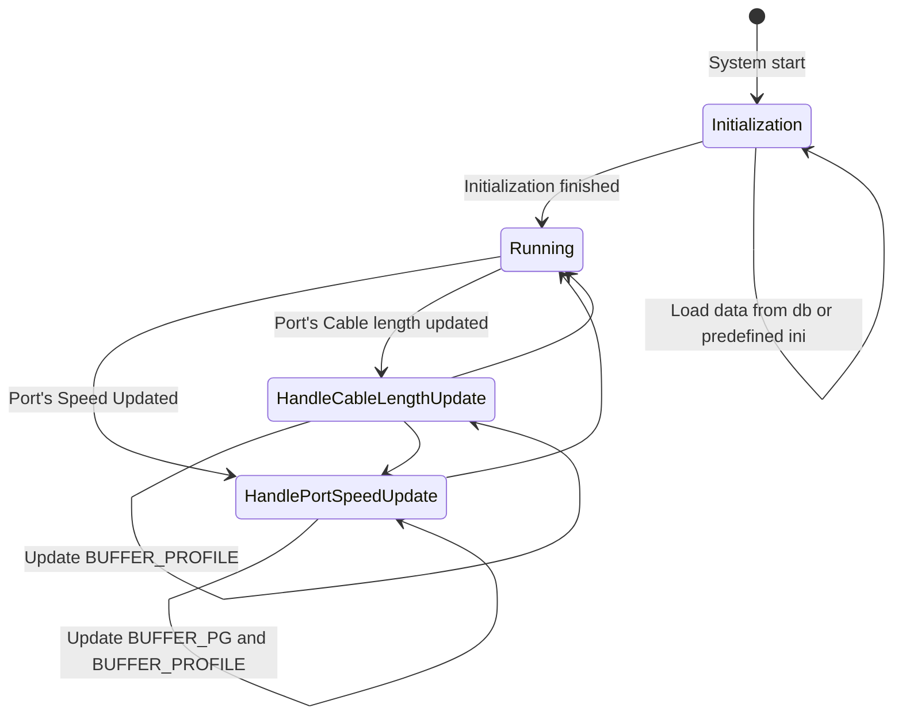

# Flow charts

```mermaid
%Allocate a New Profile
sequenceDiagram
  participant System
  participant Buffer Manager
  participant Database Service
  participant Buffer Orch
  participant SAI

  System -->>+ Buffer Manager: Allocate a profile
  Note over System, Buffer Manager: parameter: (speed, length)
  Buffer Manager -->> Database Service: Check whether there has already been a profile for the (speed, length) tuple
  Note over Buffer Manager, Database Service: Return if there is one existing
  Buffer Manager ->> Buffer Manager: [Create only] Calculate the headroom size via the well-known formula
  Buffer Manager ->> Buffer Manager: Create an entry in BUFFER_PROFILE table
  Buffer Manager -->> Database Service: Insert the profile into CONFIG_DB.BUFFER_PROFILE
  Database Service -->>+ Buffer Orch: Create a profile
  Buffer Orch -->>+ SAI: create_buffer_profile
  Buffer Orch -->>- Database Service: Finish
  Buffer Manager -->>- System: Finish
```

```mermaid
%Release a profile
sequenceDiagram
  participant System
  participant Buffer Manager
  participant Database Service
  participant Buffer Orch
  participant SAI

  System -->>+ Buffer Manager: Release a profile
  Note over System, Buffer Manager: parameter: (speed, length)
  Buffer Manager -->> Database Service: Check whether the profile is referenced any longer
  Note over Buffer Manager, Database Service: If yes, the process finish.
  Buffer Manager -->> Database Service: Destroy an entry in BUFFER_PROFILE table
  Database Service -->>+ Buffer Orch: Remove a profile
  Buffer Orch -->>+ SAI: remove_buffer_profile
  Buffer Orch -->>- Database Service: Finish
  Buffer Manager -->>- System: Finish
```

```meimaid
%Calculate shared buffer pool size
sequenceDiagram
  participant System
  participant Buffer Manager
  participant Database Service
  participant Buffer Orch
  participant SAI

  System -->>+ Buffer Manager: Recalculate shared buffer pool size
  Note over System, Buffer Manager: Flow exit in case of warm reboot
  Buffer Manager ->> Buffer Manager: Recalculate shared buffer pool size  according to total of current headroom sizes
  Note over System, Database Service: Admin down ports don't consume shared buffers
  Buffer Manager -->> Database Service: Update BUFFER_POOL
  Database Service -->>+ Buffer Orch: Notify BUFFER_POOL updated
  Buffer Orch -->>+ SAI: set_buffer_pool_attribute
  Buffer Orch -->>- Database Service: Finish
  Buffer Manager -->>- System: Finish
```

```meimaid
%Calculate the headroom for a port, PG tuple
sequenceDiagram
  participant System
  participant Buffer Manager
  participant Database Service
  participant Buffer Orch
  participant SAI

  System -->>+ Buffer Manager: Recalculate a port's headroom with new parameters
  Note over System, Database Service: parameter: (speed, length, lossless_pg), current value: (speed_old, length_old, lossless_pg_old)
  Buffer Manager ->> Buffer Manager: Allocate a profile for (speed, length) if speed != speed_old or length != length_old
  Note over System, Database Service: Happen only if lossless_pg != lossless_pg_old
  Buffer Manager ->> Buffer Manager: Remove the port's BUFFER_PG table entry indexed by (port, lossless_pg_old)
  Buffer Manager -->> Database Service: Notify BUFFER_PG|<port>|lossless_pg_old removed
  Database Service -->>+ Buffer Orch: Notify BUFFER_PG|<port>|lossless_pg_old removed
  Buffer Orch -->> SAI: set_ingress_priority_group_attribute(attribute = null oid)
  Buffer Orch -->>- Database Service: Finish
  Note over System, Database Service: Happen only if lossless_pg != empty set
  Buffer Manager ->> Buffer Manager: Update the port's BUFFER_PG table entry indexed by (port, lossless_pg)
  Buffer Manager -->> Database Service: Update BUFFER_PG
  Database Service -->>+ Buffer Orch: Notify BUFFER_PG updated
  Buffer Orch -->> SAI: set_ingress_priority_group_attribute
  Buffer Orch -->>- Database Service: Finish
  Note over Buffer Manager: Always happen
  Buffer Manager ->> Buffer Manager: Recalculate shared buffer pools
  Buffer Manager ->> Buffer Manager: Release profile for (speed_old, length_old) if speed != speed_old or length != length_old
  Buffer Manager -->>- System: Finish
```

```mermaid
%Speed change
sequenceDiagram
  participant System
  participant Buffer Manager

  System -->>+ Buffer Manager: A port's speed updated
  Note over System, Buffer Manager: No further action for headroom override.
  Buffer Manager ->> Buffer Manager: Check availability
  Buffer Manager ->> Buffer Manager: Calculate the new buffer size
  Buffer Manager -->>- System: Finish
```

```mermaid
%Cable length change
sequenceDiagram
  participant System
  participant Buffer Manager

  System -->>+ Buffer Manager: A port's cable length updated
  Note over System, Buffer Manager: No further action for headroom override.
  Buffer Manager ->> Buffer Manager: Check whether the cable length is legal
  Buffer Manager ->> Buffer Manager: Read the new cable length and store it into the internal map
  Buffer Manager ->> Buffer Manager: Calculate the new buffer size
  Buffer Manager -->>- System: Finish
```

```mermaid
%Admin Up/Down: 1. calculate or static, 2. deploy
sequenceDiagram
  participant System
  participant Buffer Manager

  System -->>+ Buffer Manager: A port's admin status is updated
  Buffer Manager ->> Buffer Manager: Recalculate the pool size
  Buffer Manager -->>- System: Finish
```

```mermaid
%Apply a new buffer PG
sequenceDiagram
  participant System
  participant Buffer Orch
  participant SAI

  System -->>+ Buffer Orch: Notify BUFFER_PG updated
  Buffer Orch -->> SAI: set_ingress_priority_group_attribute
  Buffer Orch ->> Buffer Orch: Recalculate buffer pool size
  Buffer Orch -->>- System: Finish
```

```mermaid
%Configure static headroom: 1. remove the profile current used 2. deploy the static profile
sequenceDiagram
  participant System
  participant Buffer Manager
  participant Database Service
  participant Buffer Orch
  participant SAI

  System -->>+ Buffer Manager: Configure static headroom on a port (profile)
  Note over System, Buffer Manager: Defer handling if (profile) doesn't exist
  Buffer Manager ->> Buffer Manager: Release the current applied profile for the port
  Buffer Manager -->> Database Service: Update BUFFER_PG table
  Database Service -->>+ Buffer Orch: Notify BUFFER_PG updated
  Buffer Orch -->> SAI: set_ingress_priority_group_attribute
  Buffer Orch -->>- Database Service: Finish
  Buffer Manager ->> Buffer Manager: Recalculate the shared buffer pool size
  Buffer Manager -->>- System: Finish
```

```mermaid
%De-configure static headroom:
sequenceDiagram
  participant System
  participant Buffer Manager

  System -->>+ Buffer Manager: Remove the static headroom on a port
  Buffer Manager ->> Buffer Manager: Allocate buffer profile according to port's speed and cable length
  Buffer Manager ->> Buffer Manager: Recalculate the shared buffer pool size
  Buffer Manager -->>- System: Finish
```

```mermaid
%Update static profile:
sequenceDiagram
  participant System
  participant Buffer Manager
  participant Database Service
  participant Buffer Orch

  System -->>+ Buffer Manager: Update static profile
  Buffer Manager -->> Database Service: Update corresponding buffer profile in CONFIG_DB
  Database Service -->>+ Buffer Orch: Buffer profile updated
  Buffer Orch -->>+ SAI: set_buffer_pool_attribute
  Buffer Orch -->>- Database Service: Finish
  Buffer Manager ->> Buffer Manager: Recalculate the buffer pool size
  Buffer Manager -->>- System: Finish
```


