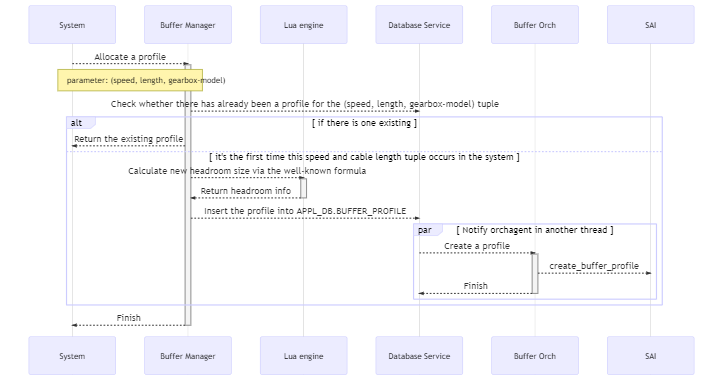
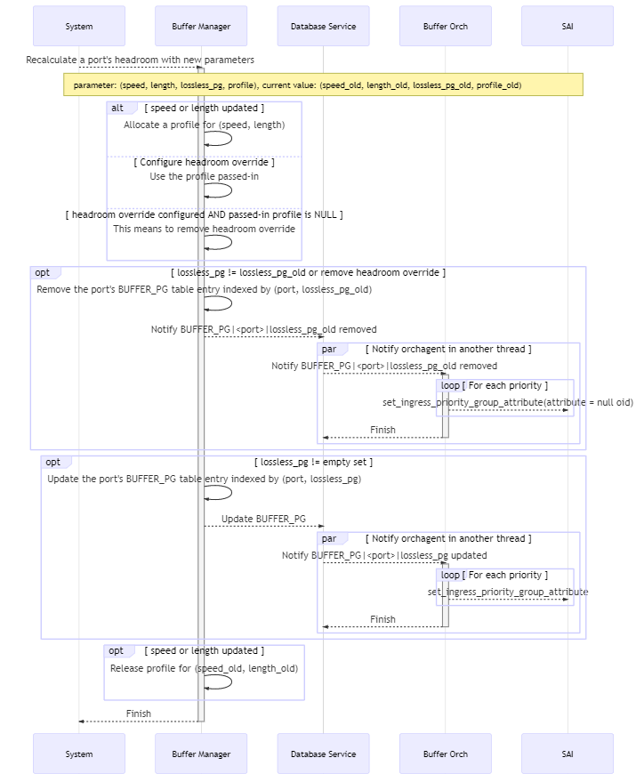
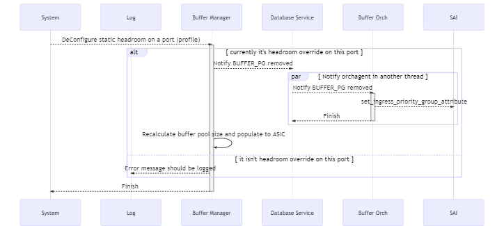

## Introduction

RoCE is an important feature in the datacenter network. As we all knew, headroom size is the key to ensure lossless traffic which is the key of RoCE.
Currently, the headroom size is calculated by looking up the port's cable length and speed in the pre-defined pg_profile_lookup.ini, which has some drawbacks.

In general, we would like to:

1. have the headroom calculated in the code so that the users won't need to be familiar with that.
2. support headroom override, which means we will have fixed headroom size on some ports regardless of the ports' length and cable length.
3. have more shared buffer and less headroom.

The headroom size calculation discussed in this design is implemented in the `BufferManager` which is a daemon running in the swss docker. When a port's speed or cable length updated it's resposible for updating the headroom size accordingly.

### Current Solution

- When system start, it reads the pg_profile_lookup.ini and generate an internal lookup table indexed by speed and cable length, and containing size, xon, xoff and threshold.
- When a port's cable length updated, it records the cable length of the port. But it doesn't update relavent tables accordingly.
- When a port's speed updated,
    1. It looks up the (speed, cable length) pair in the BUFFER_PROFILE table or generate a new profile according to the internal lookup table.
    2. And then update the port's BUFFER_PG table for the lossless priority group.

### The Requirement

We will have the following groups of parameters

- List of SONiC configuration, such as speed and cable length.
- List of ASIC related configuration, such as cell size, MAC/PHY delay, peer response time, IPG.
- List of PERIPHERIAL related configuration, such as gearbox delay.
- List of RoCE related configuration, such as MTU, small packet size percentage.

Based on the parameters and a well-known formula the code in buffer manager will do the calculation and not take it from a pre-defined values as we have today.
On top of that, we need to support the ability to override headroom and not to calculate it in the code.

Meanwhile, the backward compatibility for those vendors who haven't provided the tables required for new buffer size calculation is also provided.

## Database schema design

### CONFIG_DB

#### Table ASIC_TABLE

This table is introduced to store the switch ASIC related parameters required for calculating the headroom buffer size.

This table is not supposed to be updated on-the-fly.

##### Schema

The key can be the chip/vendor name in captical letters.

```schema
    key                     = ASIC_TABLE|<vendor name>      ; Vendor name should be in captical letters.
                                                            ; For Mellanox, "MELLANOX"
    cell_size               = 1*4DIGIT                      ; Mandatory. The cell size of the switch chip.
    ipg                     = 1*2DIGIT                      ; Optional. Inter-packet gap.
    pipeline_latency        = 1*6DIGIT                      ; Mandatory. Pipeline latency, in unit of kBytes.
    mac_phy_delay           = 1*6DIGIT                      ; Mandatory. Max/phy delay, in unit of Bytes.
    peer_response_time      = 1*6DIGIT                      ; Mandatory. The maximum of peer switch response time
                                                            ; in unit of kBytes.
```

##### Initialization

Every vendor should provide the ASIC_TABLE on a per-SKU basis. It should be stored in `/usr/shared/sonic/device/<platfrom>/<SKU>/buffers.json.j2` on the switch.

When the system starts for the first time, buffer management related tables will be initialized by `config qos reload` via rendering this template. After that the table will be loaded from config database each time system starts.

When reloading minigraph, all data from this table will be cleared and then reinitialized by `config qos reload`.

It's possible that multiple SKUs share the same switch chip thus the same set of parameters. In this case, proper vendor-specific steps should be taken to reduce redundant source files.

For Mellanox, this file is implemented only in one of all the SKUs sharing the same switch chip while all other SKUs having symbol links pointing to that file. For example, for switches based on Spectrum 1 switch chip, `buffers.json.j2` is defined in `sonic-buildimage/device/mellanox/x86_64-mlnx_msn2700-r0/` while all other Spectrum-1-based SKUs having symbol links pointing to it.

***Example***

The below is an example for Mellanox switches based on Spectrum-1 switch chip.

Demostration of a way to reduce redundant source files.

```shell
stephens@0348aa35bcb1:/sonic$ ls device/mellanox/x86_64-mlnx_msn2700-r0/ACS-MSN2700/buffers_defaults_t* -l
-rw-r--r-- 1 stephens input 3196 Feb 29 01:48 device/mellanox/x86_64-mlnx_msn2700-r0/ACS-MSN2700/buffers_defaults_t0.j2
-rw-r--r-- 1 stephens input 3196 Feb 29 01:48 device/mellanox/x86_64-mlnx_msn2700-r0/ACS-MSN2700/buffers_defaults_t1.j2
stephens@0348aa35bcb1:/sonic$ ls device/mellanox/x86_64-mlnx_msn2410-r0/ACS-MSN2410/buffers_defaults_t* -l
lrwxrwxrwx 1 stephens input 63 Feb 29 01:48 device/mellanox/x86_64-mlnx_msn2410-r0/ACS-MSN2410/buffers_defaults_t0.j2 -> ../../x86_64-mlnx_msn2700-r0/ACS-MSN2700/buffers_defaults_t0.j2
lrwxrwxrwx 1 stephens input 63 Feb 29 01:48 device/mellanox/x86_64-mlnx_msn2410-r0/ACS-MSN2410/buffers_defaults_t1.j2 -> ../../x86_64-mlnx_msn2700-r0/ACS-MSN2700/buffers_defaults_t1.j2
```

Example of pre-defined json file:

```json
    "ASIC_TABLE": {
        "MELLANOX": {
            "cell_size": "96",
            "pipeline_latency": "18",
            "mac_phy_delay": "0.8",
            "peer_response_time": "3.8",
            "small_packet_percentage": "100"
        }
    }
```

#### Table PERIPHERAL_TABLE

##### Schema

This table contains the peripheral parameters, like gearbox. The key can be gearbox model name.

This table is not supposed to be updated on-the-fly.

```schema
    key                     = PERIPHERAL_TABLE|<gearbox model name>   ; Model name should be in captical letters.
    gearbox_delay           = 1*4DIGIT      ; Optional. Latency introduced by gearbox, in unit of kBytes.
```

##### Initialization

Every vendor should provide the PERIPHERAL_TABLE on a per-SKU basis. It should be stored in `/usr/shared/sonic/device/<platfrom>/<SKU>/buffers.json.j2` on the switch.

It's possible that multiple SKUs share the same model of gearbox. In this case similar steps as that for ASIC_TABLE should be taken to reduce redundant source files.

Basically the initialization of PERIPHERAL table is the same as that of ASIC_TABLE except that it's possible a same SKU adopts variant models of gearbox in variant batch of products. In this case, parameters for all possible gearbox models should be listed in the `buffers.json` file and we suggest to find out the correct gearbox_delay in the following way:

1. The gearbox model equipped in the switch should be exposed and able to be read via sysfs or something like that.
2. When the system starts for the first time or executed `config load_minigraph` or `config qos reload`, it should read the gearbox model in the way mentioned in 1. and then load the data into config database.
3. For the other cases when system starts, it loads the data from `CONFIG_DB`.

The below is an example for Mellanox switches.

***Example***

```json
    "PERIPHERAL_TABLE": {
        "MELLANOX": {
            "gearbox_delay": "9.765"
        }
    }
```

#### Table ROCE_TABLE

This table contains the parameters related to RoCE configuration.

##### schema

```schema
    key                     = ROCE_TABLE|<name>   ; Name should be in captical letters. For example, "AZURE"
    mtu                     = 1*4DIGIT      ; Mandatory. Max transmit unit of RDMA packet, in unit of kBytes.
    small_packet_percentage = 1*3DIGIT      ; Mandatory. The percentage of small packets against all packets.
```

##### Initialization

Typically all vendors share the identical RoCE parameters. It should be stored in `/usr/share/sonic/templates/buffers_config.j2` which will be used to render the buffer configuration by `config qos reload`.

***Example***

```json
    "ROCE_TABLE": {
        "AZURE": {
            "mtu": "1500",
            "small_packet_percentage": "100"
        }
    }
```

#### BUFFER_PROFILE

Table BUFFER_PROFILE contains the profiles of headroom parameters and the proportion of free shared buffers can be utilized by a `port`, `PG` tuple on ingress side or a `port`, `queue` tuple on egress side.

##### Schema

The schema is the same as it is except the following field added.

```schema
    type        = "static" / "dynamic"      ; Optional. Whether the profile is dynamically calculated or user configured.
                                            ; Default value is "static"
```

The `static` profile is configured by CLI while the `dynamic` profile is dynamically calculated when system starts or a port's cable length or speed is updated.

##### Initialization

The following entries are mandatory and should be defined in `/usr/shared/sonic/device/<platfrom>/<SKU>/buffers.json.j2` by all vendors.

- ingress_lossless_profile
- ingress_lossy_profile
- egress_lossless_profile
- egress_lossy_profile
- q_lossy_profile

The initialization of the above entries is the same as that of ASIC_TABLE.

Besides the above entries, there are the following ones which will generated on-the-fly:

1. Headroom override entries for lossless traffic, which will be configured by user.
2. Entries for ingress loessless traffic with specific cable length and speed. They will be referenced by `BUFFER_PG` table and created when `speed`, `cable length` updated.

***Example***

An example of mandatory entries on Mellanox platform:

```json
    "BUFFER_PROFILE": {
        "ingress_lossless_profile": {
            "pool":"[BUFFER_POOL|ingress_lossless_pool]",
            "size":"0",
            "dynamic_th":"0"
        },
        "ingress_lossy_profile": {
            "pool":"[BUFFER_POOL|ingress_lossy_pool]",
            "size":"0",
            "dynamic_th":"3"
        },
        "egress_lossless_profile": {
            "pool":"[BUFFER_POOL|egress_lossless_pool]",
            "size":"0",
            "dynamic_th":"7"
        },
        "egress_lossy_profile": {
            "pool":"[BUFFER_POOL|egress_lossy_pool]",
            "size":"4096",
            "dynamic_th":"3"
        },
        "q_lossy_profile": {
            "pool":"[BUFFER_POOL|egress_lossy_pool]",
            "size":"0",
            "dynamic_th":"3"
        }
    }
```

#### BUFFER_PG

Table BUFFER_PG contains the maps from the `port, priority group` tuple to the `buffer profile` object.

##### Schema

The schema is the same as it is except the following field added.

```schema
    type        = "static" / "dynamic"      ; Optional. Whether the profile is dynamically calculated or user configured.
                                            ; Default value is "static"
```

The `static` profile is configured by CLI while the `dynamic` profile is dynamically calculated when system starts or a port's cable length or speed is updated.

##### Initialization

The entry `BUFFER_PG|<port>|0` is for ingress lossy traffic and will be generated when system starts for the first time or minigraph is loaded.

The headroom override entries are configured via CLI.

Other entries are for ingress lossless traffic and will be generated when the ports' speed or cable length updated.

#### Other tables referenced

The port speed needs to be fetched from `PORT` table.
The cable length needs to be fetched from `CABLE_LENGTH` table.
The calculated headroom size will be stored in `BUFFER_PG` table as it is.

## Flows

The following flows will be described in this section.

- When a port's speed or cable length is updated, the `BUFFER_PG`, `BUFFER_PROFILE` will be updated to relfect the headroom size regarding the new speed and cable length. As the headroom size updated, `BUFFER_POOL` will be also updated accordingly.
- When a port's admin status is updated, the `BUFFER_PG` and `BUFFER_PROFILE` won't be updated. However, as only administratively up ports consume headroom, the `BUFFER_POOL` should be updated.
- When a static profile is configured on or removed from a port, the `BUFFER_PG` and `BUFFER_PROFILE` table will be updated accordingly.
- When the system starts, how the tables are loaded.
- Warm reboot considerations.

This section will be split to two parts. In `meta flows` we will describe some flows which are building blocks of other flows. In `main flows` we will describe the flows listed in the above list.

### Meta Flows

Meta flows are the flows that will be called in other flows.

#### The well-known formula

Headroom is calculated as the following:

- `headroom` = `Xoff` + `Xon`
- `Xon` = `pipeline latency`
- `Xoff` = `mtu` + `propagation delay` * `small packet multiply`
- `worst case factor` = 2 * `cell` / (1 + `cell`)
- `small packet multiply` = (100 - `small packet percentage` + `small packet percentage` * `worst case factor`) / 100
- `propagation delay` = `mtu` + 2 * (`kb on cable` + `kb on gearbox`) + `mac/phy delay` + `peer response`
- `kb on cable` = `cable length` / `speed of light in media` * `port speed`

The values used in the above procedure are fetched from the following table:

- `cable length`: CABLE_LENGTH|\<name\>|\<port\>
- `port speed`: PORT|\<port name\>|speed
- `kb on gearbox`: PERIPHERIAL_TABLE|\<vendor name\>|other_delay
- `mac/phy delay`: ASIC_TABLE|\<vendor name\>|mac_phy_delay
- `peer response`: ASIC_TABLE|\<vendor name\>|peer_response_time
- `cell`: ASIC_TABLE|\<vendor name\>|cell_size
- `small packet percentage`: ROCE_TABLE|\<name\>|small_packet_percentage
- `mtu`: ROCE_TABLE|\<name\>|mtu

#### Allocate a new profile

When a port's `cable length` or `speed` updated, a profile related to the new `cable length`, `speed` tuple should be looked up from the database. If there isn't one, a new one should be created.

The flow is like the following:

1. Look up in database, check whether there has already been a profile related to the new `cable length` and `speed` tuple. If yes, return the entry.
2. Create a profile based on the well-known formula and insert it to the `BUFFER_PROFILE` table.
3. The `BufferOrch` will consume the update in `BUFFER_PROFILE` table and call SAI to create a new profile.



__Figure 1: Allocate a New Profile__

#### Release a no-longer-referenced profile

When a port's `cable length` or `speed` updated, the profile related to the old `cable length` or `speed` tuple probably won't be referenced any longer. In this case, the profile should be removed.


__Figure 1: Release a No-Longer-Referenced Profile__

#### Calculate the Buffer Pool Size

When any port's `cable length` or `speed` updated or `admin state` changed, the buffer pool size should be recalculated.

Each time the buffer pool size recalculated, it should go over headroom of all `port`, `priority group` tuple to calculate the total consumption of shared buffers. The administratively down port doesn't consume buffer hense they should be ruled out.


__Figure 1: Calculate the Pool Size__

#### Calculate the headroom for a port, PG

When any port's `cable length` or `speed` updated, the headroom buffer should be recalculated and deployed. The flow is:

1. Find or create a buffer profile according to the new `cable length` and `speed` tuple.
2. Update the port's buffer pg and update the BUFFER_PG table.
3. Once BufferOrch is notifed on the BUFFER_PG updated, it will update the related SAI object.
4. Recalculate the shared buffer pool size.
5. Release the buffer profile referenced by old `cable length` and `speed` tuple.



__Figure 1: Calculate the Headroom For a Port, PG__

### Main Flows

#### On system start

Try the following steps in order:

1. Load the table `ASIC_TABLE`, `PERIPHERAL_TABLE` and `ROCE_TABLE` into internal data structures:
    - If succeeded, set `calculate` flag. Finish.
    - Otherwise, try 2.
2. If failed, load the traditional pg_profile_lookup.ini into a lookup table.
    - If succeeded, set `lookup` flag.
    - Otherwise, fail the daemon.

#### On Port Speed updated

There are admin speed and operational speed in the system, which stand for the speed configured by user and negotiated with peer device respectively. In the buffer design, we are talking about the admin speed.

1. Read the speed of the port
2. Check the following conditions, exit on anyone fails:
    - Check whether `type` in `BUFFER_PG|<port>|3-4` is of `dynamic` which means dynamically calculating headroom is required for the port.
    - Check whether there is a cable length configured for the port.
    - Check whether there is a speed, cable length pair in the internal map.
3. Allocate a buffer profile related to the `cable length` and `speed`.
4. Calculate the headroom for the port, PG tuple.


__Figure 1: Port Speed Updated__

#### On Port Cable length updated

1. Check whether the cable length is legal.
    - If yes, push the length into the internal map.
    - If no, ignore. Error message should be logged.
2. After a port's cable length updated, update its BUFFER_PG according to its speed and cable length.


__Figure 1: Cable Length Updated__

#### Port is administratively up/down

When a port's administratively status is changed, the `BUFFER_PG` and `BUFFER_PROFILE` won't be touched. However, as an admin down port doesn't consume headroom buffer while an admin up one does, the sum of effective headroom size will be udpated accordingly, hense the `BUFFER_POOL` should be updated.


__Figure 1: Port Admin Up/Down__

#### Apply static headroom configure

When a static headroom is configured on a port

1. Release the buffer profile currently used on the port.
2. Update the port's buffer pg according to the configuration.
3. Recalculate the buffer pool size.


__Figure 1: Apply Static Headroom Configure__

#### Remove static headroom configure

When a static headroom is removed on a port:

1. Allocate the buffer profile according to the port's speed and cable length.
2. Recalculate the buffer pool size.



__Figure 1: Remove Static Headroom Configure__

#### Update static buffer profile

When a static buffer profile is updated, it will be propagated to `Buffer Orch` and then `SAI`. The buffer pgs that reference this buffer profile don't need to be updated. However, as the total number of headroom buffer updated, the buffer pool size should be recalculated.


### Warm restart consideration

When system starts, the port's headroom will always be recalculated according to its speed and cable length. As a result, when system warm restarts between images whose headroom size differs, the `Buffer Manager` won't read data from `BUFFER_PG` table but regenerate one for each `port`, `priority group` according to the `port`'s `speed` and `cable length` and then push the item into `BUFFER_PG` table.
In this sense, no specific steps is required for configuration migration.

## Command line interface

### To configure headroom override on a port

```cli
sonic#config interface headroom_override <port> <enable|disable> <profile>
```

The following conditions among parameters must be satisfied:

- The profile must be defined in advance.
- 

### To configure a static profile

A static profile can be used to override the headroom size and dynamic_th of a port, PG.

```cli
sonic#config buffer_profile <name> add <xon> <xoff> <headroom> <dynamic_th>
sonic#config buffer_profile <name> del
```

Among all the parameters, `xoff` is optional and all others are mandatory.
The following conditions among parameters must be satisfied:

- `xon` + `xoff` < `headroom`; For Mellanox platform xon + xoff == headroom
- When delete a profile, its `type` must be static.

## Open questions

### General topic

1. Should we still use the fixed set of cable length? Or should we support arbitrary cable length?
    - If arbitrary cable length is legal, should a no-longer-used buffer profile be removed from the database?
        - If no, the database probably will be stuffed with those items?
        - If yes, need to maintain a reference number for the profiles, which introduces unnecessary complexity.
2. After port cable length updated, should the BUFFER_PG table be updated as well?
    - Current implementation don't do that. Why?
3. With headroom size dynamically configured, is it necessary to recalculate the buffer pool size?
    - For the egress_lossy_pool, ingress_lossless_pool and ingress_lossy pool their size is the total size minus the total of headroom of all ports.
4. Lossless is supported on priority 3-4 only. Is this by design or standard or any historical reason?
5. Can shared buffer pool be updated on-the-fly?

```syslog
Mar 22 14:29:05.991084 mtbc-sonic-01-2410 ERR swss#orchagent: :- meta_generic_validation_set: SAI_BUFFER_POOL_ATTR_TYPE:SAI_ATTR_VALUE_TYPE_INT32 attr is create only and cannot be modified
Mar 22 14:29:05.991153 mtbc-sonic-01-2410 ERR swss#orchagent: :- processBufferPool: Failed to modify buffer pool, name:ingress_lossless_pool, sai object:180000000009af, status:-5
```

6. There are default headrooms for lossy traffic which are determined by SDK and SONiC isn't aware. Do they affect shared buffer calculation?
7. There is limitations from SDK/FW that there is a cap of the total number of headroom sizes of all priority groups belong to a port. For 2700 split port, this cap prevent the headroom size from being programed if the speed is 50G and cable length is 300m.
8. Originally buffer configuration had been stored in APPL_DB but were moved to CONFIG_DB later. Why? [doc](https://github.com/Azure/SONiC/wiki/Converting-old-or-creating-new-buffers-config) for reference.
9. Can buffer profile be updated on-the-fly? Only the dynamic_th.

### Database design principles -- CONFIG_DB vs APPL_DB

In the current solution all buffer relavent tables are stored in CONFIG_DB which is supposed to contain the configuration supplied by user. However, some buffer data, including some entries in the BUFFER_PROFILE table and all entries in the BUFFER_PG table, are dynamically generated when ports' speed or cable length updated and will be cleared during `config qos reload`, which means they are not real configuration.

To have dynamic entries in CONFIG_DB is confusing. But a user is able to distinguish dynamic one from static one easily considering the following two points:

1. There are only limit number of combinations of speed, cable length pair, the number of dynamically generated entries in BUFFER_PROFILE table is small.
2. All entries in BUFFER_PG table are dynamically generated.

In this sense, to have dynamic and static entries mixed together mixed together isn't a big problem for now.

However, in this design the above 2 points will no longer be true because:

1. The variant cable length will be supported, which means the number of dynamically generated entries in BUFFER_PROFILE table which related to cable length can be much larger.
2. There is going to be headroom override which means BUFFER_PG and BUFFER_PROFILE table will contain both dynamic and static entries.

These will confuse user, making them difficult to distinguish static and dynamic entries and understand the configuration. In addition, this makes the logic of `config qos reload` more complicated, because it has to remain user supplied configuration while clearing all the dynamic entries.

To resolve the issue, we have the following principles in the database schema design:

1. All the configuration are stored in CONFIG_DB, including BUFFER_PG, BUFFER_POOL and BUFFER_PROFILE tables.
2. Dynamically generated tables are stored in APPL_DB.

### Review Comments Fixed

1. Need to update the schema and how the above tables will be generated and on which location those are available and how we can use them on the different SKUs.
2. Schema definition should be before describing flows in the design doc.
3. Motivation of this feature is missing, need to add
4. Do we have an existing tool for buffer configuration? should it be updated?
5. Speed: logic is based on admin speed and not operational speed. need to clarify it.
6. Missing flow of port admin up/down
7. Suggest to have separate flow diagram for each flow. it is more readable
8. Check also Onyx design on buffers. Owner is Vova. ask for the doc and set a meeting with him.
9. regarding warmboot: some of the configuration is done during running and this means we keep changing. the buffer configuration is already configured in the ASIC during the warmboot we should not reconfigure it again and again. need to configure it once at the end of the warmboot. till then dont touch it.
