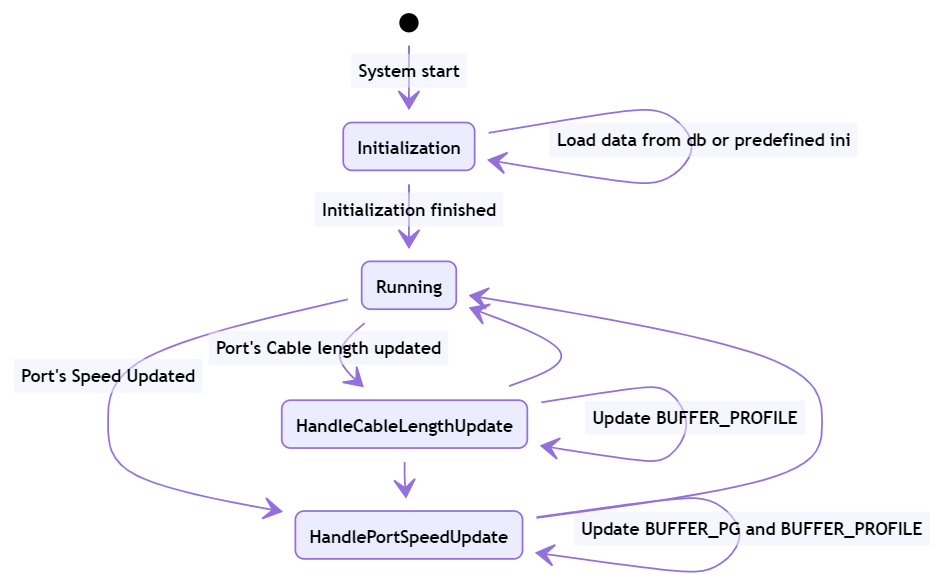

# Introduction
RoCE is an important feature int datacenter network. As we all knew, headroom size is the key to ensure lossless traffic which is the key of RoCE.
Currently, the headroom size is calculated by looking up the port's cable length and speed in the pg_profile_lookup.ini.

In this design, we're going to introduce a new way of calculating the headroom.

The headroom size calculation discussed in this design is implemented in the `BufferManager` which is a daemon running in the swss docker. When a port's speed or cable length updated it's resposible for updating the headroom size accordingly.

## Current Solution

- When system start, it reads the pg_profile_lookup.ini and generate an internal lookup table indexed by speed and cable length, and containing size, xon, xoff and threshold.
- When a port's cable length updated, it records the cable length of the port. But it doesn't update relavent tables accordingly.
- When a port's speed updated,
    1. It looks up the (speed, cable length) pair in the BUFFER_PROFILE table or generate a new profile according to the internal lookup table.
    2. And then update the port's BUFFER_PG table for the lossless priority group.

## The Requirement
We will have the following groups of parameters
- List of SONiC configuration (such as speed and cable length)
- List of pg configuration (such as cell size, IPG, MTU, Peer response time, small packet size percentage)

Based on the parameters and a well-known formula the code in buffer manager will do the calculation and not take it from a pre-defined values as we have today.
On top of that, we need to support the ability to override headroom and not to calculate it in the code.

# Design
## The overall flow

 - When system starts, load the SWITCH_PARAMETER table or the pg_profile_lookup.ini.
 - When CABLE_LENGTH table updated,
    1. Record the cable length into an internal map
    2. Update the port's BUFFER_PG accordingly if it is `dynamic`.
 - When a port's speed updated
    1. Check whether the port's BUFFER_PG is `static`. If yes, finish (this is headroom override, nothing to do).
    2. Find or create the corresponding BUFFER_PROFILE by calculating based on the formula or looking up the table
    3. Generate or update the port's BUFFER_PG for lossless PG.


__Figure 1: Flow Chart of Headroom Calculation__



__Figure 2: State Transmit Digram of Headroom Calculation__

## Database design
### schema
#### Table SWITCH_PARAMETERS

This table is introduced to store the necessary vendor specific parameters required for calculating the headroom buffer size.
##### Schema
The key should be the vendor name in captical letters. For Mellanox, "MELLANOX".
```
    key                     = SWITCH_PARAMETERS|<vendor name>   ; Vendor name should be in captical letters. For Mellanox, "MELLANOX"
    cell_size               = 1*4DIGIT      ; Mandatory. The cell size of the switch chip.
    ipg                     = 1*2DIGIT      ; Optional. Inter-packet gap.
    mtu                     = 1*4DIGIT      ; Mandatory. Max transmit unit of RDMA packet, in unit of kBytes.
    pipeline_latency        = 1*6DIGIT      ; Mandatory. Pipeline latency, in unit of kBytes.
    mac_phy_delay           = 1*6DIGIT      ; Mandatory. Max/phy delay, in unit of Bytes.
    peer_response_time      = 1*6DIGIT      ; Mandatory. The maximum of peer switch response time, in unit of kBytes.
    other_delay             = 1*6DIGIT      ; Optional. Other delays not covered, in unit of kBytes. An example is gearbox delay.
    small_packet_percentage = 1*3DIGIT      ; Mandatory. The percentage of small packets against all packets.
```
##### Initialization
Every vendor should provide the SWITCH_PARAMETERS on a per-SKU basis. It should be stored in `/usr/shared/sonic/device/<platfrom>/<SKU>/buffers.json.j2`
The below is an example for Mellanox switches
***Example***
```
    "SWITCH_PARAMETERS": {
        "MELLANOX": {
            "cell_size": "144",
            "mtu": "1.5",
            "pipeline_latency": "18",
            "mac_phy_delay": "0.8",
            "peer_response_time": "3.8",
            "small_packet_percentage": "100"
        }
    }
```
This table is not supposed to be updated on-the-fly.
#### BUFFER_PROFILE
Table BUFFER_PROFILE contains the profiles of headroom parameters and the proportion of free shared buffers can be utilized by a port, PG tuple (ingress) or a port, queue tuple (egress). 
In order to support headroom override, the following filed needs to be added to the table:
```
    type        = "static" / "dynamic"      ; Optional. Whether the profile is dynamically calculated or user configured.
                                            ; Default value is "static"
```
The `static` profile is configured by CLI while the `dynamic` profile is dynamically calculated when system starts or a port's cable length or speed is updated.
#### BUFFER_PG
Table BUFFER_PG contains the maps from the `port, priority group` tuple to the `buffer profile` object. 
Currently, the schema is as the following:
```
    key         = BUFFER_PG|<port>|<priority groups>
    profile     = ref_hash_key_reference    ; Mandatory. Points to an entry in BUFFER_PROFILE table 
                                            ; according to the speed and cable length of the port
``` 
In order to support headroom override, the following field needs to be added to the table:
```
    type        = "static" / "dynamic"      ; Mandatory. dynamic means a dynamically calculated buffer profile is adopted
                                            ; while static means a static profile is adopted for headroom override. 
```
If a BUFFER_PG entry has a type of `static`, the BUFFER_PROFILE entry it points to should also be with `static` type.

#### Other tables referenced
The port speed needs to be fetched from `PORT` table.
The cable length needs to be fetched from `CABLE_LENGTH` table.
The calculated headroom size will be stored in `BUFFER_PG` table as it was.

## The detailed flows
### The well-known formula
Headroom is calculated as the following:
 - `headroom` = `Xoff` + `Xon`
 - `Xon` = `pipeline latency`
 - `Xoff` = `mtu` + `propagation delay` * `small packet multiply`
 - `worst case factor` = 2 * `cell` / (1 + `cell`)
 - `small packet multiply` = (100 - `small packet percentage` + `small packet percentage` * `worst case factor`) / 100
 - `propagation delay` = `mtu` + 2 * (`kb on cable` + `kb on gearbox`) + `mac/phy delay` + `peer response`
 - `kb on cable` = `cable length` / `speed of light in media` * `port speed`

The values used in the above procedure are fetched from the following table:
 - `cable length`: CABLE_LENGTH|\<name\>|\<port\>
 - `port speed`: PORT|\<port name\>|speed
 - `kb on gearbox`: SWITCH_PARAMETERS|\<vendor name\>|other_delay
 - `mac/phy delay`: SWITCH_PARAMETERS|\<vendor name\>|mac_phy_delay
 - `peer response`: SWITCH_PARAMETERS|\<vendor name\>|peer_response_time
 - `cell`: SWITCH_PARAMETERS|\<vendor name\>|cell_size

### On system start

Try the following steps in order:
1. Load the table SWITCH_PARAMETERS into an internal dictionary:
    - If succeeded, set `calculate` flag. Finish.
    - Otherwise, try 2.
2. If failed, load the traditional pg_profile_lookup.ini into a lookup table.
    - If succeeded, set `lookup` flag.
    - Otherwise, fail the daemon.

### On Port Speed updated

1. Read the speed of the port
2. Check the following conditions, exit on anyone fails:
    - Check whether `type` in `BUFFER_PG|<port>|3-4` is of `dynamic` which means dynamically calculating headroom is required for the port.
    - Check whether there is a cable length configured for the port.
    - Check whether there is a speed, cable length pair in the internal map.
3. If there already has been a profile for the given speed, cable length pair in the BUFFER_PROFILE table, just use it.
4. Otherwise, create a new one by:
    - If `calculate`, calculating based on formula
    - If `lookup`, looking up from the lookup table
   and then insert it into BUFFER_PROFILE table.
5. Generate a new item referencing the name of the matched/newly-created profile, insert it into BUFFER_PG with key `<Port>|3-4`,

### On Port Cable length updated

1. Check whether the cable length is legal.
    - If yes, push the length into the internal map.
    - If no, ignore. Error message should be logged.
2. After a port's cable length updated, should the BUFFER_PG updated?
    - If yes, update BUFFER_PG according to its speed and cable length.

## Command line interface
### To configure headroom override on a port

```
sonic#config interface headroom_override <port> <enable|disable> <profile>
```
The following conditions among parameters must be satisfied:
 - The profile must be defined in advance.
 - 

### To configure a static profile
A static profile can be used to override the headroom size and dynamic_th of a port, PG.
```
sonic#config buffer_profile <name> add <xon> <xoff> <headroom> <dynamic_th>
sonic#config buffer_profile <name> del
```
Among all the parameters, `xoff` is optional and all others are mandatory.
The following conditions among parameters must be satisfied:
 - `xon` + `xoff` < `headroom`; For Mellanox platform xon + xoff == headroom
 - When delete a profile, its `type` must be static.

## Warm restart consideration
When system starts, the port's headroom will always be recalculated according to its speed and cable length. As a result, when system warm restarts between images whose headroom size differs, the `Buffer Manager` won't read data from `BUFFER_PG` table but regenerate one for each `port`, `priority group` according to the `port`'s `speed` and `cable length` and then push the item into `BUFFER_PG` table.
In this sense, no specific steps is required for configuration migration.

## Open questions

1. Should we still use the fixed set of cable length? Or should we support arbitrary cable length?
    - If arbitrary cable length is legal, should a no-longer-used buffer profile be removed from the database?
        - If no, the database probably will be stuffed with those items?
        - If yes, need to maintain a reference number for the profiles, which introduces unnecessary complexity.
2. After port cable length updated, should the BUFFER_PG table be updated as well?
    - Current implementation don't do that. Why?
3. With headroom size dynamically configured, is it necessary to recalculate the buffer pool size?
    - For the egress_lossy_pool, ingress_lossless_pool and ingress_lossy pool their size is the total size minus the total of headroom of all ports.
4. Lossless is supported on priority 3-4 only. Is this by design or standard or any historical reason?