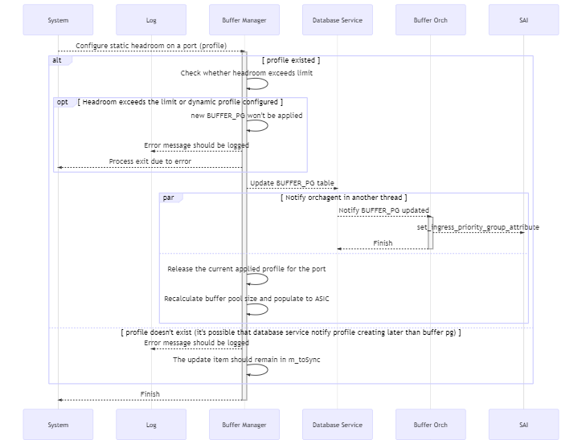

## Introduction

RoCE is an important feature in the datacenter network. As we all knew, headroom size is the key to ensure lossless traffic which is the key of RoCE.
Currently, the headroom size is calculated by looking up the port's cable length and speed in the pre-defined pg_profile_lookup.ini, which has some drawbacks.

In general, we would like to:

1. have the headroom calculated in the code so that the users won't need to be familiar with that.
2. support headroom override, which means we will have fixed headroom size on some ports regardless of the ports' length and cable length.
3. have more shared buffer and less headroom.

In this design, we're going to introduce a new way of calculating the headroom.

The headroom size calculation discussed in this design is implemented in the `BufferManager` which is a daemon running in the swss docker. When a port's speed or cable length updated it's resposible for updating the headroom size accordingly.

### Current Solution

- When system start, it reads the pg_profile_lookup.ini and generate an internal lookup table indexed by speed and cable length, and containing size, xon, xoff and threshold.
- When a port's cable length updated, it records the cable length of the port. But it doesn't update relavent tables accordingly.
- When a port's speed updated,
    1. It looks up the (speed, cable length) pair in the BUFFER_PROFILE table or generate a new profile according to the internal lookup table.
    2. And then update the port's BUFFER_PG table for the lossless priority group.

### The Requirement

We will have the following groups of parameters

- List of SONiC configuration, such as speed and cable length.
- List of ASIC related configuration, such as cell size, MAC/PHY delay, peer response time, IPG.
- List of PERIPHERIAL related configuration, such as gearbox delay.
- List of RoCE related configuration, such as MTU, small packet size percentage.

Based on the parameters and a well-known formula the code in buffer manager will do the calculation and not take it from a pre-defined values as we have today.
On top of that, we need to support the ability to override headroom and not to calculate it in the code.

## Design

### Database schema design

#### Database design principles

In the current solution all buffer relavent tables are stored in CONFIG_DB which is supposed to contain the configuration supplied by user. However, some buffer data, including some entries in the BUFFER_PROFILE table and all entries in the BUFFER_PG table, are dynamically generated when ports' speed or cable length updated and will be cleared during `config qos reload`, which means they are not real configuration.

To have dynamic entries in CONFIG_DB is confusing. But a user is able to distinguish dynamic one from static one easily considering the following two points:

1. There are only limit number of combinations of speed, cable length pair, the number of dynamically generated entries in BUFFER_PROFILE table is small.
2. All entries in BUFFER_PG table are dynamically generated.

In this sense, to have dynamic and static entries mixed together mixed together isn't a big problem for now.

However, in this design the above 2 points will no longer be true because:

1. The variant cable length will be supported, which means the number of dynamically generated entries in BUFFER_PROFILE table which related to cable length can be much larger.
2. There is going to be headroom override which means BUFFER_PG and BUFFER_PROFILE table will contain both dynamic and static entries.

These will confuse user, making them difficult to distinguish static and dynamic entries and understand the configuration. In addition, this makes the logic of `config qos reload` more complicated, because it has to remain user supplied configuration while clearing all the dynamic entries.

To resolve the issue, we have the following principles in the database schema design:

1. All the configuration are stored in CONFIG_DB, including BUFFER_PG, BUFFER_POOL and BUFFER_PROFILE tables.
2. Dynamically generated tables are stored in APPL_DB.

#### CONFIG_DB

##### Table ASIC_TABLE

This table is introduced to store the switch ASIC related parameters required for calculating the headroom buffer size.

This table is not supposed to be updated on-the-fly.

The key can be the chip/vendor name in captical letters. For Mellanox, "MELLANOX".

```schema
    key                     = ASIC_TABLE|<vendor name>      ; Vendor name should be in captical letters.
                                                            ; For Mellanox, "MELLANOX"
    cell_size               = 1*4DIGIT                      ; Mandatory. The cell size of the switch chip.
    ipg                     = 1*2DIGIT                      ; Optional. Inter-packet gap.
    pipeline_latency        = 1*6DIGIT                      ; Mandatory. Pipeline latency, in unit of kBytes.
    mac_phy_delay           = 1*6DIGIT                      ; Mandatory. Max/phy delay, in unit of Bytes.
    peer_response_time      = 1*6DIGIT                      ; Mandatory. The maximum of peer switch response time
                                                            ; in unit of kBytes.
```

Every vendor should provide the ASIC_TABLE on a per-SKU basis. It should be stored in `/usr/shared/sonic/device/<platfrom>/<SKU>/buffers.json.j2` on the switch.

When the system starts for the first time, buffer management related tables will be initialized by `config qos reload` via rendering this template. After that the table will be loaded from config database each time system starts.

When reloading minigraph, all data from this table will be cleared and then reinitialized by `config qos reload`.

It's possible that multiple SKUs share the same switch chip thus the same set of parameters. In this case, proper vendor-specific steps should be taken to reduce redundant source files.

For Mellanox, this file is implemented only in one of all the SKUs sharing the same switch chip while all other SKUs having symbol link pointing to that file. For example, for switches based on Spectrum 1 switch chip, `buffers.json.j2` is defined in `sonic-buildimage/device/mellanox/x86_64-mlnx_msn2700-r0/` while all other Spectrum-1-based SKUs having symbol link pointing to it.

```shell
stephens@0348aa35bcb1:/sonic$ ls device/mellanox/x86_64-mlnx_msn2700-r0/ACS-MSN2700/buffers_defaults_t* -l
-rw-r--r-- 1 stephens input 3196 Feb 29 01:48 device/mellanox/x86_64-mlnx_msn2700-r0/ACS-MSN2700/buffers_defaults_t0.j2
-rw-r--r-- 1 stephens input 3196 Feb 29 01:48 device/mellanox/x86_64-mlnx_msn2700-r0/ACS-MSN2700/buffers_defaults_t1.j2
stephens@0348aa35bcb1:/sonic$ ls device/mellanox/x86_64-mlnx_msn2410-r0/ACS-MSN2410/buffers_defaults_t* -l
lrwxrwxrwx 1 stephens input 63 Feb 29 01:48 device/mellanox/x86_64-mlnx_msn2410-r0/ACS-MSN2410/buffers_defaults_t0.j2 -> ../../x86_64-mlnx_msn2700-r0/ACS-MSN2700/buffers_defaults_t0.j2
lrwxrwxrwx 1 stephens input 63 Feb 29 01:48 device/mellanox/x86_64-mlnx_msn2410-r0/ACS-MSN2410/buffers_defaults_t1.j2 -> ../../x86_64-mlnx_msn2700-r0/ACS-MSN2700/buffers_defaults_t1.j2
```

The below is an example for Mellanox switches based on Spectrum-1 switch chip.

***Example***

```json
    "ASIC_TABLE": {
        "MELLANOX": {
            "cell_size": "96",
            "pipeline_latency": "18",
            "mac_phy_delay": "0.8",
            "peer_response_time": "3.8",
            "small_packet_percentage": "100"
        }
    }
```

##### Table PERIPHERAL_TABLE

This table contains the peripheral parameters, like gearbox. The key can be gearbox model name.

This table is not supposed to be updated on-the-fly.

```schema
    key                     = PERIPHERAL_TABLE|<gearbox model name>   ; Model name should be in captical letters.
    gearbox_delay           = 1*4DIGIT      ; Optional. Latency introduced by gearbox, in unit of kBytes.
```

Every vendor should provide the PERIPHERAL_TABLE on a per-SKU basis. It should be stored in `/usr/shared/sonic/device/<platfrom>/<SKU>/buffers.json.j2` on the switch.

It's possible that multiple SKUs share the same model of gearbox. In this case similar steps should be taken to reduce redundant source files.

Meanwhile it's also possible that a same SKU adopts variant models of gearbox in variant batch of products. In this case, we suggest to find out the correct gearbox_delay in the following way:

1. The gearbox equipped in the switch should be exposed and able to read via sysfs or something like that.
2. When the system starts for the first time, it should read the gearbox model in the switch and then load the data into config database.

The below is an example for Mellanox switches.

***Example***

```json
    "PERIPHERAL_TABLE": {
        "MELLANOX": {
            "gearbox_delay": "9.765"
        }
    }
```

##### Table ROCE_TABLE

This table contains the parameters related to RoCE configuration.

###### schema

```schema
    key                     = ROCE_TABLE|<name>   ; Name should be in captical letters. For example, "AZURE"
    mtu                     = 1*4DIGIT      ; Mandatory. Max transmit unit of RDMA packet, in unit of kBytes.
    small_packet_percentage = 1*3DIGIT      ; Mandatory. The percentage of small packets against all packets.
```

###### Initialization

Typically all vendors share the identical RoCE parameters. It should be stored in `/usr/share/sonic/templates/buffers_config.j2` which will be used to render the buffer configuration by `config qos reload`.

***Example***

```json
    "ROCE_TABLE": {
        "AZURE": {
            "mtu": "1500",
            "small_packet_percentage": "100"
        }
    }
```

##### BUFFER_PROFILE

Table BUFFER_PROFILE contains the profiles of headroom parameters and the proportion of free shared buffers can be utilized by a port, PG tuple (ingress) or a port, queue tuple (egress).

The schema is the same as it is but the content of the table will be changed. This table in CONFIG_DB will contain static configured data (AKA headroom override) only. All the dynamically generated table entries which are in this table now will be moved to the counterpart of APPL_DB.

The static configured entries includes:

1. Headroom override entries for lossless traffic, which will be configured by user.
2. Egress related profiles, including egress_lossless_profile and q_lossy_profile.
3. Profiles to be used in BUFFER_PORT_EGRESS_PROFILE_LIST and BUFFER_PORT_INGRESS_PROFILE_LIST.

An example of those static data:

```json
    "BUFFER_PROFILE": {
        "ingress_lossless_profile": {
            "pool":"[BUFFER_POOL|ingress_lossless_pool]",
            "size":"0",
            "dynamic_th":"0"
        },
        "ingress_lossy_profile": {
            "pool":"[BUFFER_POOL|ingress_lossy_pool]",
            "size":"0",
            "dynamic_th":"3"
        },
        "egress_lossless_profile": {
            "pool":"[BUFFER_POOL|egress_lossless_pool]",
            "size":"0",
            "dynamic_th":"7"
        },
        "egress_lossy_profile": {
            "pool":"[BUFFER_POOL|egress_lossy_pool]",
            "size":"4096",
            "dynamic_th":"3"
        },
        "q_lossy_profile": {
            "pool":"[BUFFER_POOL|egress_lossy_pool]",
            "size":"0",
            "dynamic_th":"3"
        }
    }
```

When system starts, all the entries in BUFFER_PROFILE will be propagated to APPL_DB.

##### BUFFER_PG

Table BUFFER_PG contains the maps from the `port, priority group` tuple to the `buffer profile` object.

The schema is the same as it is but the content of the table will be changed. This table in CONFIG_DB will contain static configured data (AKA headroom override) only. All the dynamically generated table entries which are in this table now will be moved to the counterpart of APPL_DB.
In order to support headroom override, the following field needs to be added to the table:

#### APPL_DB

##### BUFFER_PROFILE

TBD.

##### BUFFER_PG

The schema is as the following:

```schema
    key         = BUFFER_PG|<port>|<priority groups>
    profile     = ref_hash_key_reference    ; Mandatory. Points to an entry in BUFFER_PROFILE table 
                                            ; according to the speed and cable length of the port
```

##### Other tables referenced

The port speed needs to be fetched from `PORT` table.
The cable length needs to be fetched from `CABLE_LENGTH` table.
The calculated headroom size will be stored in `BUFFER_PG` table as it was.

### Flows

#### Flow Design Principles

For all the flows we have the following principles:

1. The buffer manager contains the following logic:
    - checking all the necessary conditions
        - the port is admin up
        - cable length is configured
    - calculating the headroom size and push the result to APPL_DB
    - checking whether a dynamic buffer profile is being referenced by a buffer priority group object
2. The content of APPL_DB should be alwasy aligned with that of ASIC_DB.

#### The overall flow

- When system starts, load the SWITCH_PARAMETER table or the pg_profile_lookup.ini.
- When CABLE_LENGTH table updated,
    1. Record the cable length into an internal map
    2. Update the port's BUFFER_PG accordingly if it is `dynamic`.
- When a port's speed updated
    1. Check whether the port's BUFFER_PG is `static`. If yes, finish (this is headroom override, nothing to do).
    2. Find or create the corresponding BUFFER_PROFILE by calculating based on the formula or looking up the table
    3. Generate or update the port's BUFFER_PG for lossless PG.


__Figure 2: State Transmit Digram of Headroom Calculation__

#### Meta Flows

Meta flows are the flows that will be embedded in other flows.

##### The well-known formula

Headroom is calculated as the following:

- `headroom` = `Xoff` + `Xon`
- `Xon` = `pipeline latency`
- `Xoff` = `mtu` + `propagation delay` * `small packet multiply`
- `worst case factor` = 2 * `cell` / (1 + `cell`)
- `small packet multiply` = (100 - `small packet percentage` + `small packet percentage` * `worst case factor`) / 100
- `propagation delay` = `mtu` + 2 * (`kb on cable` + `kb on gearbox`) + `mac/phy delay` + `peer response`
- `kb on cable` = `cable length` / `speed of light in media` * `port speed`

The values used in the above procedure are fetched from the following table:

- `cable length`: CABLE_LENGTH|\<name\>|\<port\>
- `port speed`: PORT|\<port name\>|speed
- `kb on gearbox`: PERIPHERIAL_TABLE|\<vendor name\>|other_delay
- `mac/phy delay`: ASIC_TABLE|\<vendor name\>|mac_phy_delay
- `peer response`: ASIC_TABLE|\<vendor name\>|peer_response_time
- `cell`: ASIC_TABLE|\<vendor name\>|cell_size
- `small packet percentage`: ROCE_TABLE|\<name\>|small_packet_percentage
- `mtu`: ROCE_TABLE|\<name\>|mtu

##### Allocate a new profile


__Figure 1: Allocate a New Profile__

##### Release a no-longer-referenced profile


__Figure 1: Release a No-Longer-Referenced Profile__

##### Calculate the Pool Size


__Figure 1: Calculate the Pool Size__

##### Calculate the headroom for a port, PG


__Figure 1: Calculate the Headroom For a Port, PG__

#### Main Flows

##### On system start

Try the following steps in order:

1. Load the table SWITCH_PARAMETERS into an internal dictionary:
    - If succeeded, set `calculate` flag. Finish.
    - Otherwise, try 2.
2. If failed, load the traditional pg_profile_lookup.ini into a lookup table.
    - If succeeded, set `lookup` flag.
    - Otherwise, fail the daemon.

##### On Port Speed updated

There are admin speed and operational speed in the system, which stand for the speed configured by user and negotiated with peer device respectively. In the buffer design, we are talking about the admin speed.

1. Read the speed of the port
2. Check the following conditions, exit on anyone fails:
    - Check whether `type` in `BUFFER_PG|<port>|3-4` is of `dynamic` which means dynamically calculating headroom is required for the port.
    - Check whether there is a cable length configured for the port.
    - Check whether there is a speed, cable length pair in the internal map.
3. If there already has been a profile for the given speed, cable length pair in the BUFFER_PROFILE table, just use it.
4. Otherwise, create a new one by:
    - If `calculate`, calculating based on formula
    - If `lookup`, looking up from the lookup table
   and then insert it into BUFFER_PROFILE table.
5. Generate a new item referencing the name of the matched/newly-created profile, insert it into BUFFER_PG with key `<Port>|3-4`,


__Figure 1: Port Speed Updated__

##### On Port Cable length updated

1. Check whether the cable length is legal.
    - If yes, push the length into the internal map.
    - If no, ignore. Error message should be logged.
2. After a port's cable length updated, should the BUFFER_PG updated?
    - If yes, update BUFFER_PG according to its speed and cable length.


__Figure 1: Cable Length Updated__

##### Port is administratively up/down


__Figure 1: Port Admin Up/Down__

##### Apply static headroom configure



__Figure 1: Apply Static Headroom Configure__

##### Remove static headroom configure


__Figure 1: Remove Static Headroom Configure__

### Command line interface

#### To configure headroom override on a port

```cli
sonic#config interface headroom_override <port> <enable|disable> <profile>
```

The following conditions among parameters must be satisfied:

- The profile must be defined in advance.
- 

#### To configure a static profile

A static profile can be used to override the headroom size and dynamic_th of a port, PG.

```cli
sonic#config buffer_profile <name> add <xon> <xoff> <headroom> <dynamic_th>
sonic#config buffer_profile <name> del
```

Among all the parameters, `xoff` is optional and all others are mandatory.
The following conditions among parameters must be satisfied:

- `xon` + `xoff` < `headroom`; For Mellanox platform xon + xoff == headroom
- When delete a profile, its `type` must be static.

### Warm restart consideration

When system starts, the port's headroom will always be recalculated according to its speed and cable length. As a result, when system warm restarts between images whose headroom size differs, the `Buffer Manager` won't read data from `BUFFER_PG` table but regenerate one for each `port`, `priority group` according to the `port`'s `speed` and `cable length` and then push the item into `BUFFER_PG` table.
In this sense, no specific steps is required for configuration migration.

### Open questions

1. Should we still use the fixed set of cable length? Or should we support arbitrary cable length?
    - If arbitrary cable length is legal, should a no-longer-used buffer profile be removed from the database?
        - If no, the database probably will be stuffed with those items?
        - If yes, need to maintain a reference number for the profiles, which introduces unnecessary complexity.
2. After port cable length updated, should the BUFFER_PG table be updated as well?
    - Current implementation don't do that. Why?
3. With headroom size dynamically configured, is it necessary to recalculate the buffer pool size?
    - For the egress_lossy_pool, ingress_lossless_pool and ingress_lossy pool their size is the total size minus the total of headroom of all ports.
4. Lossless is supported on priority 3-4 only. Is this by design or standard or any historical reason?
5. Can shared buffer pool be updated on-the-fly?

```syslog
Mar 22 14:29:05.991084 mtbc-sonic-01-2410 ERR swss#orchagent: :- meta_generic_validation_set: SAI_BUFFER_POOL_ATTR_TYPE:SAI_ATTR_VALUE_TYPE_INT32 attr is create only and cannot be modified
Mar 22 14:29:05.991153 mtbc-sonic-01-2410 ERR swss#orchagent: :- processBufferPool: Failed to modify buffer pool, name:ingress_lossless_pool, sai object:180000000009af, status:-5
```

6. There are default headrooms for lossy traffic which are determined by SDK and SONiC isn't aware. Do they affect shared buffer calculation?
7. There is limitations from SDK/FW that there is a cap of the total number of headroom sizes of all priority groups belong to a port. For 2700 split port, this cap prevent the headroom size from being programed if the speed is 50G and cable length is 300m.
8. Originally buffer configuration had been stored in APPL_DB but were moved to CONFIG_DB later. Why? [doc](https://github.com/Azure/SONiC/wiki/Converting-old-or-creating-new-buffers-config) for reference.
9. Can buffer profile be updated on-the-fly? Only the dynamic_th.

### Review Comments Fixed

1. Need to update the schema and how the above tables will be generated and on which location those are available and how we can use them on the different SKUs.
2. Schema definition should be before describing flows in the design doc.
3. Motivation of this feature is missing, need to add
4. Do we have an existing tool for buffer configuration? should it be updated?
5. Speed: logic is based on admin speed and not operational speed. need to clarify it.
6. Missing flow of port admin up/down
7. Suggest to have separate flow diagram for each flow. it is more readable
8. Check also Onyx design on buffers. Owner is Vova. ask for the doc and set a meeting with him.
9. regarding warmboot: some of the configuration is done during running and this means we keep changing. the buffer configuration is already configured in the ASIC during the warmboot we should not reconfigure it again and again. need to configure it once at the end of the warmboot. till then dont touch it.
