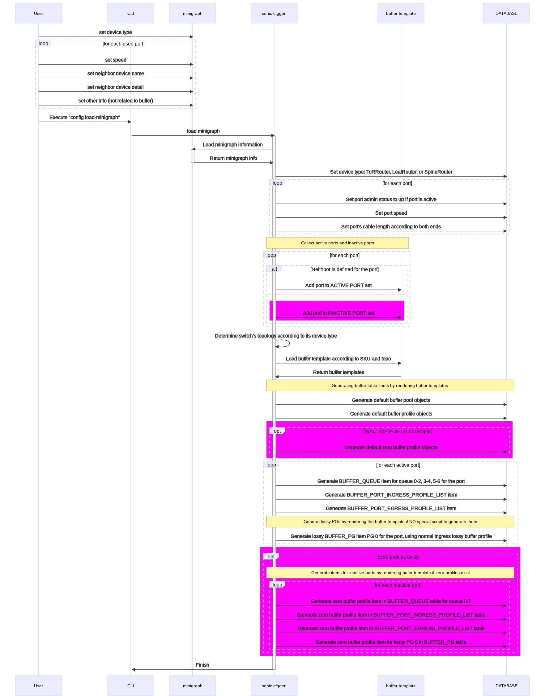

# Reclaim reserved buffer #

## 1 Table of Content ###

### 1.1 Revision ###

## 2 Scope ##

This section describes the scope of this high-level design document in SONiC.

## 3 Definitions/Abbreviations ##

This section covers the abbreviation if any, used in this high-level design document and its definitions.

## 4 Overview ##

Shared buffer is used to absorb traffic when a switch is under congestion. The larger the buffer, the better the performance in terms of congestion handling.

On Mellanox platforms, buffers are reserved for each port, PG and queue. The size of shared buffer pool is equal to the total memory minus the accumulative reserved buffers. So we would like to reduce the reserved buffer as many as possible. One way to do that is to reclaim the buffers reserved for admin down ports.

There are some admin down ports in user's scenario. There should not be any buffer reserved for admin down ports but currently there are by default.

The purpose of this document is to provide a way to reclaim the buffer reserved for admin down ports and then increase the shared buffer pool size.

## 5 Requirements ##

The requirement is to reclaim the reserved buffer for admin down ports, including:

- Buffer reserved SONiC configuration
  - BUFFER_PG
  - BUFFER_QUEUE
  - BUFFER_PORT_INGRESS_PROFILE_LIST / BUFFER_PORT_EGRESS_PROFILE_LIST
- Buffer reserved by SDK/SAI for objects that are not configured by SONiC, out of scope of this design but will be addressed by SAI
  - management PG when the port is shutdown
  - If the SONiC configures buffer pools
    - The default lossy priority group configured by SDK

## 6 Architecture Design ##

The SONiC will destroy the related priority groups, queues and port ingress / egress buffer profile lists for admin down ports. It will call related SAI API with `SAI_NULL_OBJECT_ID` as SAI OID. The SAI will set the reserved buffer of the objects to zero.

## 7 Static buffer model ##

In static buffer model, buffer manager is responsible for:

- Create a buffer profile entry in `CONFIG_DB.BUFFER_PROFILE` table when the `speed`, `cable length` tuple occurs for the first time

  The parameters, including `xon`, `xoff`, `size`, `threshold` are looked up from `pg_profile_lookup.ini` with `speed` and `cable length` as the key.
- Create a buffer priority-group entry in `CONFIG_DB.BUFFER_PG` table.

All other buffer related configuration will be provided by the user.

### 7.1 Deploy the buffer configuration for a switch ###

By default, the buffer configuration is applied during deployment of the switch. Buffer configuration will be applied on active ports only. A port with neighbor device defined in `minigraph` will be treated as an active port.

To deploy the switch, the related information should be provided by user in `minigraph`. The information related to buffer configuration includes:

- Device type which can be one of `ToRRouter`, `LeafRouter`, and `SpineRouter`.
- Speed of each active port
- Neighbor device of each active port
- Meta data of the neighbors of active ports, like `type`, which which can be one of `server`, `ToRRouter`, `LeafRouter`, and `SpineRouter`.

The system will generate necessary items and push them into `CONFIG_DB`, which effectively configures buffer for the active ports.

- `admin status` in `PORT` table
  - `up` for active ports
  - `down` for inactive ports
- `speed` in `PORT` table
- `cable length` in `CABLE_LENGTH` table
  - `40m` for ports connected between a `LeafRouter` and a `ToRRouter`
  - `300m` or `2000m` for ports connected between a `LeafRouter` and a `SpineRouter`
  - `5m` otherwise
- Determine switch's topology according to switch's device type:
  - `ToRRouter` - t0
  - `LeafRouter` - t1
- Create the following items by rendering `buffer template` according to `hwsku` and `topo`
  - Buffer pools in `BUFFER_POOL` table
    - `ingress_lossless_pool`
    - `ingress_lossy_pool`, only available in general SKU
    - `egress_lossless_pool`
    - `egress_lossy_pool`
  - Buffer profiles in `BUFFER_PROFILE` table
    - `ingress_lossless_profile`, for ingress lossless port buffer pool
    - `ingress_lossy_profile`, for ingress lossy port buffer pool and priority group
    - `egress_lossless_profile`, for egress lossless port buffer pool and queue
    - `egress_lossy_profile`, for egress lossy port buffer pool
    - `q_lossy_profile`, for egress lossy queue
  - Buffer queue items in `BUFFER_QUEUE` table
  - Buffer priority group items in `BUFFER_PG` table
  - Buffer ingress and egress port profile list in `BUFFER_PORT_INGRESS_PROFILE_LIST` and `BUFFER_PORT_EGRESS_PROFILE_LIST` respectively.

#### 7.1.1 The flow to deploy a switch ####

In the flow, SAI clearing reserved size of ingress lossy priority group, which is the blue area in the flow chart, is suggested to be implemented. Otherwise, there will be buffer oversubscription.

All other steps exist.



#### 7.1.2 The flow to handle `speed`, `cable length` and `admin status` of the port ####

In the flow, buffer manager testing port's admin status and skipping the rest part if it's admin-down, which is the green area in the flow chart, needs to be implemented.

All other steps exist.


#### 7.1.3 The flow to handle `BUFFER_QUEUE` table add entry ####

This is an existing flow. No code change is required.


#### 7.1.4 The flow to handle `BUFFER_PORT_INGRESS_PROFILE_LIST`, and `BUFFER_PORT_EGRESS_PROFILE_LIST` table add entry ####

This is an existing flow. No code change is required.


#### 7.1.5 The flow to set port's management priority-group to default value ####

In the flow, SAI setting headroom size of management priority-group to the defaule value, which is the blue area in the flow chart, needs to be implemented.

All other steps exist.


** Note: The port shutdown and startup flow can also be triggered by other flows. In that case, SAI will still handle the management priority-group.

### 7.2 Enable a port and configure buffer for it ###

The following buffer profiles should be created before enabling a port and configuring buffer for it. By default, they are defined in `buffer template` and will be applied when the `minigraph` is reloaded.

- `ingress_lossless_profile`
- `ingress_lossy_profile`
- `egress_lossless_profile`
- `egress_lossy_profile`
- `q_lossy_profile`

The following items need to be configured to enable a port and configure buffer for it. By default, they are defined in `buffer template` or `minigraph` and will be applied when the the `minigraph` is reloaded.

In case the user wants to re-enable a disabled port, he needs to configure the following items manually.

- Set `admin status` to `up` for the port by executing command `config interface startup <port>`.
- Add following entries in the corresponding buffer table for the port.
  
  Currently there is not any commands or other UI that user can use to add the following items. So the only way for a user to configure them is to compose a json file containing all the items and then to execute `sonic-cfggen -j <json-file-name> --write-to-db`. We will give an example of each items.
  - PG 0 in `CONFIG_DB.BUFFER_PG` table as a lossy priority group with `BUFFER_PROFILE|ingress_lossy_profile` as the `profile`

    An example of PG items for port `Ethernet0`:

    ```json
    {
        "BUFFER_PG": {
            "Ethernet0|0": {
                "profile": "[BUFFER_PROFILE|ingress_lossy_profile]"
            }
        }
    }
    ```

  - Queues `0-2`, `5-6` in `CONFIG_DB.BUFFER_QUEUE` as lossy queues with `BUFFER_PROFILE|q_lossy_profile` as the `profile`
  - Queues `3-4` in `CONFIG_DB.BUFFER_QUEUE` as lossless queues with `BUFFER_PROFILE|egress_lossless_profile` as the `profile`

    An example of queue items for port `Ethernet0`:

    ```json
    {
        "BUFFER_QUEUE": {
            "Ethernet0|0-2": {
                "profile": "[BUFFER_PROFILE|q_lossy_profile]"
            },
            "Ethernet0|3-4": {
                "profile": "[BUFFER_PROFILE|egress_lossless_profile]"
            },
            "Ethernet0|5-6": {
                "profile": "[BUFFER_PROFILE|q_lossy_profile]"
            }
        }
    }
    ```

  - An item in `CONFIG_DB.BUFFER_PORT_INGRESS_PROFILE_LIST` table with the following profiles in the `profile_list`
    - `BUFFER_PROFILE|ingress_lossless_profile` for `ingress_lossless_pool`
    - `BUFFER_PROFILE|ingress_lossy_profile` for `ingress_lossy_pool` if the pool exists

    An example of ingress profile list item for port `Ethernet0` for single ingress pool mode:

    ```json
    {
        "BUFFER_PORT_INGRESS_PROFILE_LIST": {
            "Ethernet0": {
                "profile_list": "[BUFFER_PROFILE|ingress_lossless_profile]"
            }
        }
    }
    ```

  - An item in `CONFIG_DB.BUFFER_PORT_EGRESS_PROFILE_LIST` table with the following profiles in the `profile_list`
    - `BUFFER_PROFILE|egress_lossless_profile` for `egress_lossless_pool`
    - `BUFFER_PROFILE|egress_lossy_profile` for `egress_lossy_pool`

    An example of egress profile list item for port `Ethernet0`:

    ```json
    {
        "BUFFER_PORT_EGRESS_PROFILE_LIST": {
            "Ethernet0": {
                "profile_list": "[BUFFER_PROFILE|egress_lossless_profile],[BUFFER_PROFILE|egress_lossy_profile]"
            }
        }
    }
    ```

- Recalculate the sizes of shared buffer pool and shared headroom pool and configure them.

After the flow has been successfully executed:

- A lossless profile with name convention `pg_lossless_<speed>_<cable-length>_profile` will be created and inserted into `BUFFER_PROFILE` table.
- The priority group `3-4` will be created and inserted into `BUFFER_PG` table, referencing the buffer profile.
- Priority group `3` and `4` is enabled with corresponding headroom parameters (`headroom size`, `xon`, `xoff`) and alpha on the port.
- Priority group `0` is enabled with pipeline latency as `headroom size`.
- Reserved sizes and alpha of queue and port ingress/egress buffer pool are set according to the buffer profile referenced by the corresponding buffer tables.
- Headroom size of management priority group of the port is set to default value.
- Sizes of shared buffer pool and shared headroom pool are set according to configuration.

The flows are the same as those of deploy a switch.

### 7.3 Disable a port and reclaim the buffer reserved for the port ###

The user needs to:

- Set the admin status of the port to `down` via executing command `config interface shutdown <port>`.
- Remove the following entries of the port from `CONFIG_DB`. By default, they will not be configured on a disabled port, which is enforced by `buffer template`.

  In case the user enabled a port and then decides to disable it, the following entries are in the system and the user has to remove them manually.

  There is no way for a user to remove items from the `CONFIG_DB` on the fly. So the only way for a user to do it is to remove the items from `config_db.json` and then to execute `config reload`. Examples of items in each of the following tables are provided in the previous chapter.
  - entries of admin-down ports in table `BUFFER_QUEUE`, `BUFFER_PORT_INGRESS_PROFILE_LIST` and `BUFFER_PORT_EGRESS_PROFILE_LIST`
  - lossy priority-groups of admin-down ports in table `BUFFER_PG`
- Calculate the sizes of shared buffer pool and shared headroom pool and then reconfigure them in `BUFFER_POOL` table in `CONFIG_DB`.

After the flow has been successfully executed:

- The entry of lossless priority-group `3-4` of the port is removed from `BUFFER_PG` table in `CONFIG_DB`
- Reserved size and headroom size of port's priority group `0`, `3` and `4` are zero.
- Reserved size of queues and port buffer pools of the port are zero.
- Sizes of shared buffer pool and shared headroom pool are updated accordingly.
- Reserved size and headroom size of port's management priority-group is zero.

The flows of this are the same as those of deploy a switch.

### 7.4 Summary: flows need to be implemented to support reclaiming reserved buffer of admin down ports ###

According to the flows described in above sections, the following flows need to be implemented:

1. Buffer manager to test port's admin status before creating lossless priority group for the port.
2. Buffer manager to remove port's lossless priority group once the port's admin status is changed to down.
3. Buffer orch to handle `BUFFER_PG`, and `BUFFER_QUEUE` removing.
4. Buffer orch to configure zero buffer profile in `BUFFER_PORT_INGRESS_PROFILE_LIST` and `BUFFER_PORT_EGRESS_PROFILE_LIST`.
5. SAI to set headroom size of management priority group according to port's admin status.

## 8 Dynamic buffer model ##

In dynamic buffer model, the buffer reserved for admin-down ports has been reclaimed execpt the reserved buffer in `BUFFER_PORT_INGRESS_PROFILE_LIST` / `BUFFER_PORT_EGRESS_PROFILE_LIST` table and management PG.

So we need to add the following flow to reclaim them:

1. Remove `BUFFER_PORT_INGRESS_PROFILE_LIST` / `BUFFER_PORT_EGRESS_PROFILE_LIST` from `APPL_DB` when a port is admin down.
   Readd them when a port is admin up.
2. Adjust buffer pool calculator, taking the following into account:
   - Don't reserve buffer in `BUFFER_PORT_INGRESS_PROFILE_LIST` / `BUFFER_PORT_EGRESS_PROFILE_LIST` table for admin down ports as buffer manager will remove them from `APPL_DB`
   - Don't reserve buffer for management PG for admin down ports as SAI will remove them from SDK

## 9 SAI API ##

### 9.1 Reclaim priority groups ###

The SAI API `sai_buffer_api->set_ingress_priority_group_attribute` is used for reclaiming reservied buffer for priority groups. The arguments should be the following:

    attr.id = SAI_INGRESS_PRIORITY_GROUP_ATTR_BUFFER_PROFILE;
    attr.value.oid = SAI_NULL_OBJECT_ID;
    sai_buffer_api->set_ingress_priority_group_attribute(pg_id, &attr); // pg_id is the SAI object ID of the priority group

After this SAI API called, the reserved buffer of the priority group indicated by pg_id will be set to zero.

### 9.2 Reclaim queues ###

The SAI API `sai_queue_api->set_queue_attribute` is used for reclaiming reservied buffer for queues. The arguments should be the following:

    attr.id = SAI_QUEUE_ATTR_BUFFER_PROFILE_ID;
    attr.value.oid = SAI_NULL_OBJECT_ID;
    sai_queue_api->set_queue_attribute(queue_id, &attr); // queue_id is the SAI object ID of the queue

After this SAI API called, the reserved buffer of the queue indicated by pg_id will be set to zero.

### 9.3 Reclaim port reserved buffers ###

The SAI API `sai_port_api->set_port_attribute` is used for reclaiming reserved buffer for port buffer pools. The arguments should be the following:

    // Reclaim reserved buffer on ingress side
    attr.id = SAI_PORT_ATTR_QOS_INGRESS_BUFFER_PROFILE_LIST
    attr.value.objlist.list = [OID of zero profile for each ingress pools]
    attr.value.objlist.count = 2;
    sai_port_api->set_port_attribute(port.m_port_id, &attr);

    // Reclaim reserved buffer on egress side
    attr.id = SAI_PORT_ATTR_QOS_EGRESS_BUFFER_PROFILE_LIST
    attr.value.objlist.list = [OID of zero profile for each egress pools]
    attr.value.objlist.count = 2;
    sai_port_api->set_port_attribute(port.m_port_id, &attr);

### 9.4 Reclaim reserved buffers allocated by SDK ###

SAI should set the reserved buffer of objects allocated by SDK by default to 0. This is suggested to be done during creating ports.
It include the following objects:

1. Reserved buffer for default lossy priority group (pipeline latency) if SONiC doesn't create `BUFFER_PG|<port>|0`.
2. Reserved buffer for queues that are not created by SONiC, like queue 8~16.
3. Reserved port buffer pool allocated by SDK.

The SAI API `sai_port_api->create_port` is used for creating ports.

After this SAI API called, the reserved buffer of such objects will be set to zero.

## 10 Configuration and management ##

N/A

### 10.1 CLI/YANG model Enhancements ###

N/A

### 10.2 Config DB Enhancements ###

N/A

## 11 Warmboot and Fastboot Design Impact ##

No impact on warm/fast boot.

## 12 Restrictions/Limitations ##

N/A

## 13 Testing Requirements/Design ##

### 13.1 Unit Test cases ###

#### Shutdown / startup a port ####

Lossless PGs should be removed when a port is shutdown.

1. Choose an admin-up port to test
2. Shutdown the port
3. Check whether the lossless PGs have been removed from the `CONFIG_DB` and `ASIC_DB`
4. Startup the port
5. Check whether the lossless PGs have been readded to the `CONFIG_DB` and `ASIC_DB`

### 13.2 System Test cases ###

#### Shutdown / startup a port ####

Lossless PGs should be removed when a port is shutdown. Sizes of shared headroom pool and shared buffer pool should be adjusted accordingly.

1. Choose a port which is admin up to test
2. Shutdown the port
3. Check whether the lossless PGs have been removed from the `CONFIG_DB` and `ASIC_DB`
4. Adjust the sizes of shared headroom pool and shared buffer pool
5. Check whether the adjusted sizes are correct
6. Startup the port
7. Check whether the lossless PGs have been readded to the `CONFIG_DB` and `ASIC_DB`
8. Adjust the sizes of shared headroom pool and shared buffer pool
9. Check whether the adjusted sizes are correct

## 14 Open/Action items - if any ##

### 14.1 clearing reserved buffer of objects allocated by SDK ###

- Whether SAI should clear reserved size of such objects
  - In any case
  - Or only if SONiC has created buffer pools?
- SONiC not creating buffer pools means no buffer configured by SONiC. Clearing reserved size of such objects will result in 0 reserved buffer in default lossy priority group. Will this hurt traffic?
  - Sometimes there is no QoS configuration in SONiC and the system will run with SDK default in this case.

- No guarantee that buffer pool will be created before ports created in SONiC.

### 14.2 db migrator ###

#### Is db migrator necessary ####

Database migrator is introduced to take care of sizes in buffer pools and lossless buffer profiles changed.

Originally, we would like to introduce db migrator in order to set the buffer pool sizes with reserved buffer of unused ports reclaimed when the system is migrated from an old image without reclaiming unused buffer supported to a new image with it.

Meanwhile, as in the old image the reserved buffer can't be reclaimed, it doesn't make sense for an user to adjust buffer pool size in the old image.

As a result, we don't need to change db migrator for this feature if we decided that it's always user's responsiblity to configure buffer pool sizes after reclaiming reserved buffer.

#### The script to calculate the reclaimed buffer size ####

This script is to calculate the size of buffer that has been reclaimed for admin down ports.

It will be invoked in the following scenarios:

- Calculate the shared buffer pool and shared headroom pool in `db_migrator` for comparing with the default buffer configurations against the current value.

The flow:

1. Fetch the default shared buffer pool sizes from the buffer templates according to the `SKU` and `topology`.
2. For each admin down ports
   1. Fetch its speed and cable length
   2. Calculate the PG size, xoff size.
3. Put the `size`s of all PGs of admin-down ports together, getting the accumulative size
4. Put the `xoff`s of all PGs of admin-down ports together, getting the accumulative xoff
5. Calculate the accumulative private headroom of admin-down ports if shared headroom pool is enabled
   - `10 kB` * `number of admin-down ports`
6. Calculate other per port reserved buffer
   - egress reserved buffer as `egress_lossy_profile.size` * `number of admin-down ports`
   - reserved headroom for mirror as `10 kB` * `number of admin-down ports`
7. Add `accumulative size` + (`accumulative xoff` - `accumulative private headroom`) / 2 + `per port egress reserved` to the shared buffer pool
8. Subtract `accumulative xoff` / 2 from the shared headroom pool size

#### buffer migrator ####

There is a logic in `Mellanox buffer migrator`: only the buffer configuration matches the default value in old image will it be migrated to the default value in new images.
If the reserved buffer of admin down ports are reclaimed and added back to shared buffer pool, the buffer configuration won't match the default one, which means the buffer configuration won't be migrated. An example is like this:

1. Currently, the `201911` version is used. The database version is `VERSION_1_0_6`.
2. The user reclaims buffer from admin-down ports and adds them back to shared buffer pool, which causes the size of the shared buffer pools don't match the default one in `VERSION_1_0_6`.
3. The user will upgrade switch to `202012` version. The database version is `VERSION_2_0_0`. `db_migrator` compares the current buffer configuration against the default one in `VERSION_1_0_6` and finds they are not same and will not migrate buffer configuration to the default values in `VERSION_2_0_0`.

This can be avoided by:

- subtracting the reclaimed buffer size from shared buffer pool size
- using the difference as the default one when comparing

The flow is like this:

1. For each flavor in default configurations in the old version
   - Adjust the shared buffer pool size and shared headroom pool size in the default configuration
   - Compare it with the current buffer configuration in the switch
   - if they matches
     - record the `current flavor`
     - break the iteration
2. Stop the flow if none of the adjusted default configuration matches the current configuration
3. Pick the default configuration of the `current flavor`
4. Adjust the sharred buffer pool size and shared headroom pool size according to the number of admin down ports
5. Apply the adjusted buffer configurations

Open question

1. Should we migrate the buffer pool size to the one with reserved buffer for admin-down ports' reclaimed? Don't prefer to doing so.

### 14.3 Disable a port and reclaim buffer without executing config reload in traditional model ###

Currently, there is no way for a user to reclaim reserved buffer without executing `config reload` because it requires removing buffer items from `CONFIG_DB` on the fly, which is not supported by any user interface.

In case a user is able to remove items from `CONFIG_DB` on the fly, the system will handle them in the following flows.
#### 14.3.1 The flow to handle admin status change of the port ####

In the flow, buffer manager handling port admin status change, which is the green area in the flow chart, needs to be implemented.

All other steps exist.


#### 14.3.2 The flow to handle `BUFFER_QUEUE` removing ####

In the flow:

- Buffer manager handling `BUFFER_QUEUE` table removing, which is the green area in the flow chart, needs to be implemented.
- Buffer orch handling `BUFFER_QUEUE` table removing, which is the green area, needs to be implemented.
- SAI handling `sai_queue_api->set_queue_attribute` already exists.
- All other steps exist.


#### 14.3.3 The flow to handle `BUFFER_PORT_INGRESS_PROFILE_LIST` and `BUFFER_PORT_EGRESS_PROFILE_LIST` ####


This is a new flow which needs to be implemented.

#### 14.3.4 The flow to handle sizes of buffer pools and shared headroom pool ####


This is an existing flow. No code change is required.

#### 14.3.5 The flow to set port's management priority-group to 0 ####

In the flow, SAI setting headroom size of management priority-group to zero, which is the blue area in the flow chart, needs to be implemented.

All other steps exist.


### 14.4 The way to set reserved buffer to zero ###

Currently, the reserved size of a buffer object is set to zero when it is removed from `BUFFER_PG` or `BUFFER_QUEUE` table. However, this creates inconsistency.

Consider the following scenarios:

1. System starting flow. SAI will leaf buffer objects untouched if there is no buffer related configuration applied from SONiC. As a result, for any buffer object,
   - There is no buffer configuration in SONiC
   - The reserved buffer size in the ASIC is the SDK default value
2. System started, an existing buffer object is removed. SONiC notifies SAI by setting profile to `SAI_NULL_OBJECT_ID`. SAI will set the reserved size of corresponding buffer object to zero. As a result, for the buffer object,
   - There is no buffer configuration in SONiC
   - The reserved buffer size in the ASIC is zero

For some of the buffer objects, the SDK default reserved size is not zero. This is to make sure the system works correctly without any buffer configuration in SONiC.
Now we have same SONiC configuration buf different reserved buffer size in the ASIC.

One way to address the inconsistency is to set the buffer configuration in the ASIC to:

- SDK default value, if there is no buffer profile configured for the object in SONiC
- SDK default value, if the buffer object is removed from SONiC
- Zero, only if the object is configured with a profile whose size is zero (AKA zero profile)

To achieve it we need to do the following steps:

1. Buffer template.

   Zero buffer profiles should be defined for ingress/egress and lossless/lossy traffic.

   ```json
   {
      "BUFFER_PROFILE" : {
        "ingress_lossless_zero_profile" : {
          "pool":"[BUFFER_POOL|ingress_lossless_pool]",
          "size":"0",
          "dynamic_th":"-8"
        },
        "ingress_lossy_zero_profile" : {
          "pool":"[BUFFER_POOL|ingress_lossy_pool]",
          "size":"0",
          "dynamic_th":"-8"
        },
        "egress_lossless_zero_profile" : {
          "pool":"[BUFFER_POOL|egress_lossless_pool]",
          "size":"0",
          "dynamic_th":"-8"
        },
        "egress_lossy_zero_profile" : {
          "pool":"[BUFFER_POOL|egress_lossy_pool]",
          "size":"0",
          "dynamic_th":"-8"
        }
      }
   }
   ```

2. Buffer template.

   Currently, there is no buffer object configured on admin-down ports. The zero profiles should be configured explicitly on admin-down ports.

   Assume port `Ethernet0` is admin-down, an example is:

   ```json
   {
     "BUFFER_PG" : {
       "Ethernet0|0" : {
         "profile": "[BUFFER_PROFILE|ingress_lossy_zero_profile]"
       },
       "Ethernet0|3-4" : {
         "profile": "[BUFFER_PROFILE|ingress_lossless_zero_profile]"
       }
     },
     "BUFFER_QUEUE" : {
       "Ethernet0|0-2" : {
         "profile": "[BUFFER_PROFILE|egress_lossy_zero_profile]"
       },
       "Ethernet0|3-4" : {
         "profile": "[BUFFER_PROFILE|egress_lossless_zero_profile]"
       },
       "Ethernet0|5-6" : {
         "profile": "[BUFFER_PROFILE|egress_lossy_zero_profile]"
       }
     },
     "BUFFER_PORT_INGRESS_PROFILE_LIST" : {
       "Ethernet0" : {
         "profile_list" : "[BUFFER_PROFILE|ingress_lossless_zero_profile],[BUFFER_PROFILE|ingress_lossy_zero_profile]"
       }
     },
     "BUFFER_PORT_EGRESS_PROFILE_LIST" : {
       "Ethernet0" : {
         "profile_list" : "[BUFFER_PROFILE|egress_lossless_zero_profile],[BUFFER_PROFILE|egress_lossy_zero_profile]"
       }
     }
   }
   ```

3. Buffer template and SAI/SDK.

   Currently, profile `ingress_lossy_profile` is for the ingress lossy priority group. It contains all zero values but the size in the ASIC will be set to pipeline-latency by SAI/SDK.
   - The profile should be redefined with pipeline latency as size. This is complicated because 8-lane ports have different pipeline latency from other ports. The buffer template can not distinguish them so it needs further research.
   - SAI/SDK should not set the size to pipeline-latency if the size passed by SONiC is zero.
4. Buffer manager.

   It should generate priority-groups `3-4` with `ingress_lossless_zero_profile` as the profile.
5. Database migrator is required to bridge the gap between the old and new system when a switch is upgraded.
